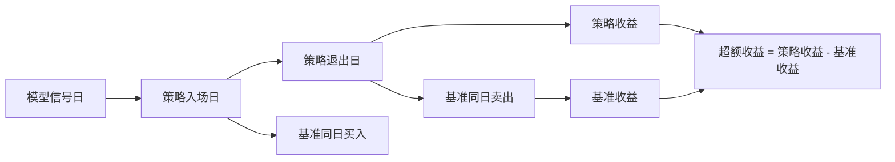

# Benchmark And Excess Return Review

## 为什么要做基准复盘

冻结股票池之后，策略年化收益从异常高的 `188.81%` 降到 `10.53%`。这时最重要的问题不是“还能不能调高收益”，而是：

```text
这个收益有没有跑赢市场？
它是模型带来的 alpha，还是只是市场本身上涨？
承担的波动和回撤是否值得？
```

没有基准，策略收益容易被误读。比如 2024-2026 如果纳斯达克本身大涨，一个策略赚了钱并不稀奇；真正关键是它有没有在同样时期跑赢基准。

## 本阶段使用什么基准

本阶段使用 FRED 的 `NASDAQCOM`：

```text
NASDAQCOM = Nasdaq Composite Index
```

它代表纳斯达克综合指数价格水平，用来近似观察“纳斯达克市场整体表现”。

注意：

```text
NASDAQCOM 不是总回报指数
不包含完整股息再投资
不是 QQQ ETF 的真实可交易净值
适合学习比较，不适合生产级绩效归因
```

后续更严谨时，可以换成：

```text
QQQ adjusted close
Nasdaq 100 Total Return Index
Russell 3000 / CRSP value-weighted index
自定义可交易基准组合
```

## 怎么对齐策略和基准

策略不是每天调仓，而是每 5 个交易日调仓一次：

```text
信号日 -> 下一交易日入场 -> 持有 5 个交易日 -> 退出
```

所以基准也必须用同一组入场日和退出日计算收益。

不能拿策略的 5 日收益去和基准每日收益直接比。



## 关键指标是什么意思

策略累计收益：

```text
Top10 组合在整个测试期的成本后收益
```

基准累计收益：

```text
NASDAQCOM 在相同入场/退出窗口内的累计收益
```

超额累计收益：

```text
策略净值 / 基准净值 - 1
```

如果超额累计收益为负，说明策略虽然赚钱，但没有跑赢基准。

Beta：

```text
策略收益对基准收益的敏感度
```

Beta 约等于 1，说明策略大体跟市场同涨同跌。Beta 大于 1，说明策略市场暴露更强。

Alpha：

```text
扣掉 beta 对市场的解释后，策略剩下的年化收益
```

Alpha 为负，说明策略的超额能力不足。

跟踪误差：

```text
超额收益的波动
```

它越高，说明策略相对基准越不稳定。

相对信息比率：

```text
平均超额收益 / 超额收益波动
```

它衡量“每承担一单位相对波动，能拿到多少超额收益”。

## 本次实验结果

配置：

```text
nasdaq_alpha158_edgar_lgbm_10y_frozen_2023_top500_5d_pit_safe
```

测试期：

```text
2024-01-02 到 2026-05-15
```

策略本身：

```text
成本后累计收益：26.41%
年化收益：10.53%
最大回撤：-31.60%
平均换手：129.98%
```

基准与超额：

```text
基准：NASDAQCOM / Nasdaq Composite Index
基准累计收益：78.78%
基准年化收益：28.17%
基准最大回撤：-22.66%
超额累计收益：-29.30%
跟踪误差：30.64%
相对信息比率：-0.319
Beta：1.092
年化 Alpha：-12.25%
策略/基准相关性：0.577
相对最大回撤：-42.98%
跑赢基准期数占比：49.15%
```

## 怎么解读

这次结论很重要：

```text
冻结股票池后的策略有绝对收益。
但它没有跑赢纳斯达克综合指数。
```

也就是说，这个模型当前还不能证明自己有稳定 alpha。

之前看到的高收益，主要来自未来信息污染和强市场环境。修正股票池后，再和基准一比，策略优势并不成立。

## 当前该做什么

下一步不应该急着调 LightGBM 参数。

更合理的路线是：

1. 做持仓贡献分析：看收益和亏损是否集中在少数股票。
2. 做行业暴露复盘：看策略是否只是押中了某些行业。
3. 做行业内 TopK 或行业中性组合：减少市场和行业 beta。
4. 引入真实历史市值、退市股票和总回报复权数据。
5. 再比较 Alpha158、EDGAR、行业相对特征是否真的带来超额收益。

## 相关笔记

[[TopK Cost Backtest]]
[[PIT Safe Backtest]]
[[Future Information Audit]]
[[Portfolio Risk Control]]
[[Stage Completion Records]]
