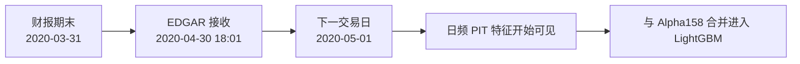
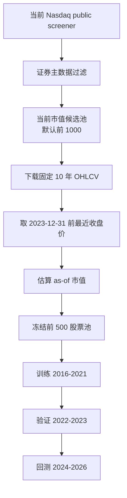

# Future Information Audit

## 本次要解决什么

这次重点检查三个未来函数风险：

1. EDGAR 财报披露是否在披露当天就被模型看到。
2. 股票池是否用 2026 年运行日的市值前 500，回测 2024 年。
3. 训练阶段如果用训练集结束前的市值前 500，能不能避免未来信息。

结论先说：

```text
EDGAR 披露当天可见：已修正为下一交易日可见。
股票池当前市值前 500：新增 as-of 2023-12-31 近似冻结股票池实验。
训练前市值前 500：方向是对的，但只有在市值、证券状态、退市和行业分类都是真实历史口径时，才能算严格 PIT。
```

## 什么是未来函数

未来函数不是只看“有没有用未来收益”。更宽泛地说，只要模型或回测在历史某一天使用了当时还不知道的信息，就属于未来信息泄漏。

常见来源：

```text
未来收益被放进特征
训练集包含测试期样本
财报按财报期末生效，而不是按披露日生效
盘后披露在当天收盘前就被使用
股票池用今天仍然存在的股票回测过去
股票池用今天市值前 500 回测过去
行业分类、证券类型、流动性过滤使用未来状态
历史长度分桶使用全窗口信息
```

## EDGAR 披露生效日

EDGAR 的 `acceptanceDateTime` 是 SEC 接收申报的时间。很多 10-K / 10-Q 会在美股收盘后披露。

如果模型在 2020-04-30 收盘前打分，却使用 2020-04-30 盘后披露的财报，这就是未来函数。

修正后规则：

```text
披露事件时间 = acceptanceDateTime
特征生效时间 = 该股票价格日历中的下一个交易日
日频 forward fill = 从生效交易日开始向后延续
```

例子：

```text
2020-04-30 18:01 EDGAR 接收 10-Q
2020-04-30 模型打分：不可见
2020-05-01 模型打分：可见
```



## as-of 冻结股票池

原来的 Nasdaq public 实验是：

```text
运行脚本当天 -> 获取当前 Nasdaq 市值前 500 -> 回测 2024-2026
```

问题是：2024 年初你不应该知道 2026 年还存活、还在当前市值前 500 的股票。

新增配置：

```text
analysis/nasdaq_top500_score/configs/nasdaq_alpha158_edgar_lgbm_10y_frozen_2023_top500_5d_pit_safe.yaml
```

新规则是：

```text
先按当前市值多取候选池
下载 2016-05-17 到 2026-05-17 的历史行情
取 2023-12-31 前最近交易日收盘价
用当前市值 * as-of close / 最新 close 估算 2023-12-31 市值
按估算市值取前 500
只保留这 500 只进入 Qlib / Alpha158 / EDGAR / LightGBM
```

这不是完美历史市值，因为 Nasdaq public 没有历史 shares outstanding，也没有退市股票。但它比直接使用运行日市值前 500 更保守。



## 训练前市值前 500 是否能避免未来信息

可以降低，但条件很严格。

如果在训练阶段固定使用：

```text
2023-12-31 当时真实可见的 Nasdaq 市值前 500
```

并且这些信息来自历史 PIT 数据，那么它能避免“用测试期后信息选股票池”的风险。

但它不能自动解决：

```text
退市股票缺失
历史 shares outstanding 缺失
历史证券类型缺失
历史行业分类缺失
财报重述和字段版本问题
复权口径不完整
```

也就是说，固定训练前股票池是正确方向，但严谨程度取决于数据源。

当前 `nasdaq_public` 版本只能算：

```text
学习级近似 PIT
不是生产级 PIT
不是完整无幸存者偏差回测
```

## 仍然残留的未来信息风险

| 风险 | 当前状态 | 影响 |
|---|---|---|
| 退市股票 | Nasdaq public 当前源缺失 | 幸存者偏差，可能高估收益 |
| 历史真实市值 | 仅用价格近似回推 | 股票池排名仍可能偏离真实历史 |
| 历史 shares outstanding | 缺失 | 市值、估值因子不够严谨 |
| 历史行业分类 | 仍是当前 snapshot | 行业 rank / 约束可能有未来分类信息 |
| 证券主数据 | 仍是当前 listed 元数据 | 过去的证券状态可能不准确 |
| 复权数据 | Nasdaq public 非专业复权口径 | 收益标签和 Alpha158 可能受拆股/分红影响 |
| 成本模型 | 固定 10 bps | 没有冲击成本、买卖价差和容量约束 |

## 本次新增输出

```text
universe_candidates.csv
universe_selection.csv
universe.csv
resolved_config.yaml
report.md
```

`universe_selection.csv` 是重点复盘文件。它记录每只候选股票：

```text
2023-12-31 前最近可用收盘日
as-of close
最新 close
当前市值
估算 as-of 市值
是否入选冻结股票池
```

## 本次冻结实验结果

配置：

```text
nasdaq_alpha158_edgar_lgbm_10y_frozen_2023_top500_5d_pit_safe
```

股票池选择：

```text
候选股票：1000
冻结入选：500
低于 as-of 前 500：407
2023-12-31 前无价格：52
下载失败或历史不足：41
```

模型与回测结果：

```text
Test 日均 IC：0.010304
Test 日均 Rank IC：-0.007921
回测期数：118
成本后累计收益：26.41%
年化收益：10.53%
年化波动：37.45%
信息比率：0.455
最大回撤：-31.60%
平均换手：129.98%
```

和上一版 PIT 过滤回测相比：

```text
PIT 过滤版年化收益：188.81%
冻结股票池版年化收益：10.53%
```

这很关键。它说明之前异常高的收益，很大一部分来自股票池未来信息，而不是模型真的有那么强。冻结股票池后，收益回到更接近真实研究的量级。

## 下一步

冻结股票池已经把收益压回更合理区间。下一步不要急着调模型，而是继续压剩余的数据口径风险：

1. 接入 Norgate / CRSP 类数据，获得退市股票和历史成分。
2. 使用真实历史 shares outstanding 计算 as-of market cap。
3. 使用历史 PIT 行业分类。
4. 加入基准超额收益、流动性容量和更真实成本。

相关笔记：

[[PIT Safe Backtest]]
[[SEC EDGAR Fundamentals Integration]]
[[Stock Pool Cleaning And History Buckets]]
[[Data Source Upgrade Plan]]
[[Stage Completion Records]]
