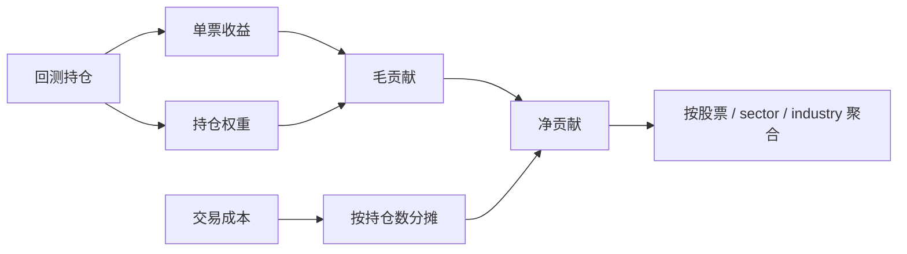

# Position Contribution And Exposure Review

## 为什么要做持仓贡献复盘

基准复盘告诉我们：当前冻结股票池策略有绝对收益，但没有跑赢纳斯达克综合指数。

下一步要回答：

```text
收益来自哪些股票？
亏损来自哪些股票？
是否过度集中在少数股票？
是否只是押中了某些行业？
```

如果策略收益靠少数几只股票支撑，或者亏损集中在某个行业，就不能只看总收益和 IC。

## 贡献怎么计算

每个回测期里，组合是等权 Top10。单只股票的毛贡献：

```text
毛贡献 = 持仓权重 * 单票持有期收益
```

交易成本也要计入。第一版采用简单分摊：

```text
单票成本贡献 = 当期总交易成本 / 当期持仓数量
单票净贡献 = 毛贡献 - 单票成本贡献
```

这样每个回测期所有股票的净贡献加总，等于组合当期净收益。



## 暴露怎么计算

行业暴露不是模型特征重要性，而是实际持仓权重。

例如某期 Top10 中有 4 只 Technology，且等权持仓：

```text
Technology 暴露 = 4 * 10% = 40%
```

对所有回测期求平均，就得到平均行业暴露。

## 本阶段新增输出

```text
contribution_by_symbol.csv
contribution_by_sector.csv
contribution_by_industry.csv
exposure_by_sector.csv
exposure_by_industry.csv
contribution_summary.yaml
```

这些文件回答不同问题：

| 文件 | 回答什么 |
|---|---|
| contribution_by_symbol.csv | 哪些股票贡献/拖累最多 |
| contribution_by_sector.csv | 哪些 sector 贡献/拖累最多 |
| contribution_by_industry.csv | 哪些 industry 贡献/拖累最多 |
| exposure_by_sector.csv | 平均押注哪些 sector |
| exposure_by_industry.csv | 平均押注哪些 industry |
| contribution_summary.yaml | 报告摘要 |

## 该怎么看

如果前 5 大正贡献股票占全部正贡献比例很高：

```text
策略收益依赖少数股票
稳定性可能较差
需要做单票贡献上限或更分散的组合
```

如果某个行业贡献特别大：

```text
策略可能是在押行业 beta
需要比较行业中性 TopK
```

如果某个行业长期负贡献：

```text
模型可能在该行业失效
可以考虑分行业训练、分行业排名，或行业黑名单复盘
```

## 当前阶段定位

这一步不是为了提升收益，而是为了拆解收益。

研究顺序应该是：

```text
先看有没有绝对收益
再看有没有跑赢基准
再看收益来自哪里
最后才考虑调模型或加特征
```

## 本次实验结果

配置：

```text
nasdaq_alpha158_edgar_lgbm_10y_frozen_2023_top500_5d_pit_safe
```

贡献集中度：

```text
前 5 大正贡献股票占全部正贡献比例：30.95%
```

正贡献最大的股票：

```text
ASST
IBRX
CAR
IOVA
OPEN
```

负贡献最大的股票：

```text
IQ
VFS
UPST
FTRE
IRTC
```

正贡献最大的 sector：

```text
Technology
Health Care
Basic Materials
```

负贡献最大的 sector：

```text
Finance
Miscellaneous
Consumer Staples
```

平均暴露最高的 sector：

```text
Health Care：32.85%
Technology：27.03%
Consumer Discretionary：17.49%
```

解读：

```text
收益不是完全靠一两只股票撑起来，但行业暴露明显偏向 Health Care 和 Technology。
既然当前相对 NASDAQCOM 超额收益为负，下一步应该先测试行业中性 TopK 或行业内排名，而不是直接加更多特征。
```

## 下一步

完成贡献复盘后，下一步可以做：

1. 行业中性 TopK：每个 sector 固定或动态分配名额。
2. 行业内排名：先在行业内排序，再合成组合。
3. 持仓集中度约束：单行业、单票、单主题限制。
4. 贡献稳定性复盘：滚动窗口看贡献是否持续。

## 相关笔记

[[Benchmark And Excess Return Review]]
[[PIT Safe Backtest]]
[[Portfolio Risk Control]]
[[Industry Neutralization]]
[[Stage Completion Records]]
