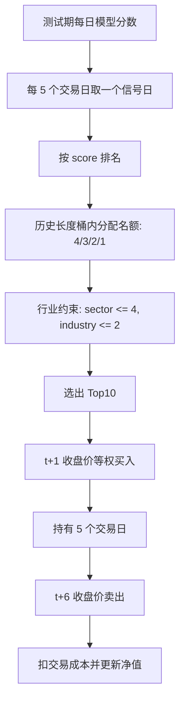

# TopK Cost Backtest

## 目标

把模型分数从“预测排序”推进到“组合回测”。

IC 只回答一个问题：模型分数和未来收益有没有相关性。TopK 成本后回测回答另一个问题：如果按模型分数买入一组股票，扣掉交易成本后，组合净值会怎样变化。

## 本次预测的是什么收益

本次使用未来 5 个交易日收益标签：

```text
Ref($close, -6) / Ref($close, -1) - 1
```

在 Qlib 的时间方向里，这个标签放在信号日 `t` 上，含义是：

```text
未来 5 日收益 = 第 t+6 个交易日收盘价 / 第 t+1 个交易日收盘价 - 1
```

也就是说，模型在 `t` 日用当时可见的特征打分，回测假设在下一个交易日 `t+1` 收盘价买入，持有 5 个交易日，到 `t+6` 收盘价卖出。

## 回测流程



## 当前配置

```text
数据窗口：2016-05-17 到 2026-05-17
训练期：2016-08-11 到 2021-12-31
验证期：2022-01-03 到 2023-12-29
测试期：2024-01-02 到 2026-05-15
标签：未来 5 个交易日收益
特征：Alpha158 + EDGAR PIT 财报估值特征
模型：LightGBM
选股：Top10
调仓：每 5 个交易日
入场：信号日后 1 个交易日收盘
退出：持有 5 个交易日后收盘
权重：等权
交易成本：单边 10 bps
```

## 本次结果

```text
回测期数：118
起始入场日：2024-01-03
最终退出日：2026-05-12
累计收益：2225.10%
年化收益：283.38%
年化波动：49.88%
信息比率：2.966
最大回撤：-18.11%
平均单期毛收益：3.05%
平均单期净收益：2.94%
胜率：66.95%
平均换手：110.93%
累计成本扣减：13.09%
平均持仓数量：9.31
```

出现次数最多的持仓：

```text
CORZ, AXTI, LUNR, NTNX, INSM, IBRX, USAR, BBIO, WULF, TEM
```

## 怎么解读

这次回测说明：在当前学习口径下，5 日标签模型分数可以被转成一个有正收益曲线的 Top10 组合。它比只看最新 Top10 更进一步，因为它使用了整个测试期的历史预测，而不是只拿最后一天做展示。

但这个结果不能直接理解为“策略有效”或“可以买”。

主要原因：

```text
使用当前 Nasdaq public 股票池，不是历史 PIT 成分池
免费行情口径不等同于专业复权行情
没有退市股票，仍有幸存者偏差风险
只用收盘价成交，没有模拟真实滑点和冲击成本
没有做基准超额收益，例如相对 Nasdaq 100 或 S&P 500
没有做容量约束和单票成交占比约束
行业分类仍是当前 snapshot，不是历史 PIT 行业分类
```

## 输出文件

```text
analysis/nasdaq_top500_score/runs/nasdaq_alpha158_edgar_lgbm_10y_clean_bucket_top10_5d/backtest_nav.csv
analysis/nasdaq_top500_score/runs/nasdaq_alpha158_edgar_lgbm_10y_clean_bucket_top10_5d/backtest_positions.csv
analysis/nasdaq_top500_score/runs/nasdaq_alpha158_edgar_lgbm_10y_clean_bucket_top10_5d/backtest_summary.yaml
analysis/nasdaq_top500_score/runs/nasdaq_alpha158_edgar_lgbm_10y_clean_bucket_top10_5d/report.md
```

## 下一步

下一阶段要做的是把回测从“绝对收益”升级为“可比较的策略评估”：

```text
加入基准收益和超额收益
记录相对回撤
做行业权重暴露复盘
加入更真实的成交成本和容量约束
用 PIT 股票池和退市股票减少幸存者偏差
```

继续学习 [[Portfolio Risk Control]] 和 [[Industry Neutralization]]。
