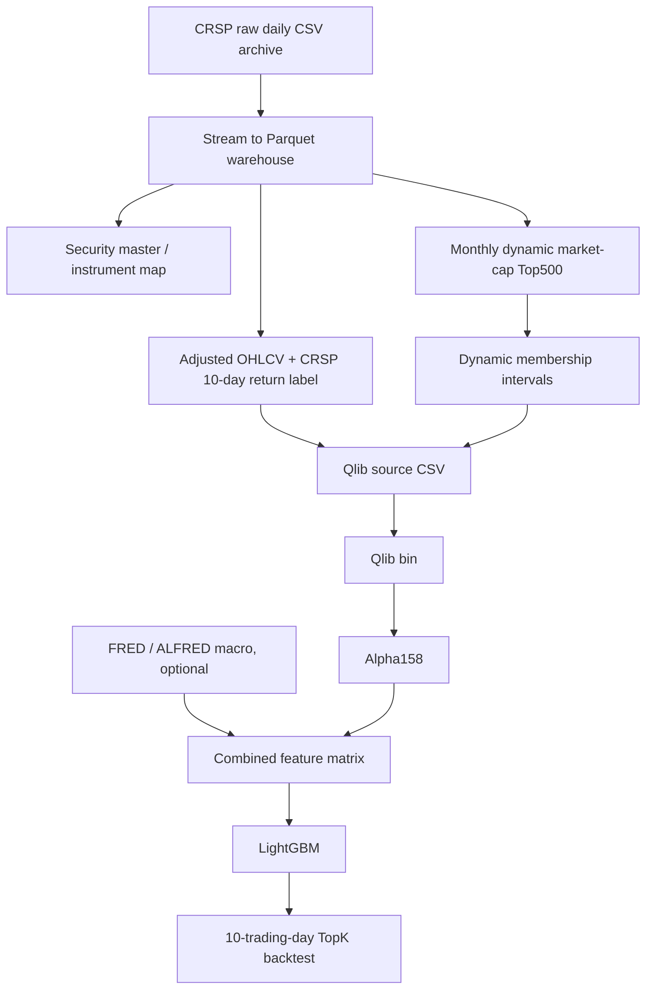

# CRSP Data Source Migration Plan

## Summary

本阶段目标是把当前 `nasdaq_public`、Databento、Sharadar 的学习数据源，迁移到本地 CRSP 日级数据。默认研究窗口固定为：

```text
2000-01-03 ~ 2025-12-31
```

最终策略口径改为：

```text
股票池：CRSP US Common Equity 月度动态市值 Top500
调仓：每 10 个交易日一次，约两周
标签：未来 10 个交易日总收益
训练主干：CRSP OHLCV -> Alpha158 -> LightGBM
宏观：FRED / ALFRED 可接入 2000-2025
财报：EDGAR 第一版不默认启用，先做覆盖率和 PERMNO -> CIK 映射评估
```

这次迁移的重点不是继续追高回测收益，而是把数据口径从“当前快照学习数据”推进到更适合严谨研究的历史数据库。核心原则是：

```text
Universe at T = f(data <= T)
```

也就是某一天能买什么股票，只能由那一天之前已经存在的数据决定。

## Why CRSP

当前 `nasdaq_public` 的主要风险是：

- 使用当前证券列表，天然缺退市股票。
- 当前市值和当前公司状态会污染历史股票池。
- 价格口径、拆股、分红、退市收益不完整。
- Nasdaq 当前 Top500 不适合作为 2000-2025 的严谨历史策略范围。

CRSP 本地日级数据提供了更好的研究底座：

- `PERMNO` 是稳定证券 ID，ticker 变化不会破坏历史。
- `DlyCap` 可用于当日 PIT 市值排序。
- `DlyRet` 包含分红等总收益信息，适合训练标签和收益复盘。
- `DlyRetx` 是不含分红的价格收益，适合构造拆股调整后的研究价格。
- 数据中包含 active、delisted、halted 等历史状态字段，可减少幸存者偏差。

## Target Data Flow



## Local Storage Design

原始 CSV 只作为归档，不作为训练时反复扫描的入口：

```text
analysis/nasdaq_top500_score/runs/crsp_daily_raw/crsp0025.csv
```

本地数据仓放在 ignored runs 目录：

```text
analysis/nasdaq_top500_score/runs/crsp_warehouse/
```

第一版仓储产物：

```text
crsp_daily/year=YYYY/*.parquet
crsp_security_master.parquet
crsp_monthly_top500_membership.parquet
crsp_instrument_map.parquet
crsp_returns.parquet
crsp_execution_prices.parquet
```

训练时读取 Parquet / Qlib bin，不重复扫描 26GB 原始 CSV。查询优先使用 Parquet；需要临时聚合时再引入 DuckDB，不默认使用 PostgreSQL 这类重型数据库。

## Stock Universe

默认股票池不再是 `NASDAQ Common Equity Top500`，而是：

```text
CRSP US Common Equity monthly dynamic Top500
```

每月最后一个交易日计算一次市值排名：

```text
filter date = month_end_trade_date
SecurityType = EQTY
SecuritySubType = COM
IssuerType = CORP
USIncFlg = Y
TradingStatusFlg = A
PrimaryExch in major US exchanges
DlyCap > 0
exclude ADR / funds / preferred / warrants / rights / units / bonds / notes
rank by DlyCap desc
take top 500
```

membership 从下一个交易日开始生效，避免把月末收盘市值用于同一天盘中选股。

关键字段：

```text
month_end_date
effective_start
effective_end
permno
instrument
ticker_asof
rank
dlycap
primary_exchange
security_type
is_delisted_later
```

## Instrument Identity

Qlib instrument 使用 CRSP 永久 ID：

```text
P{PERMNO}
```

例如：

```text
PERMNO 14593 -> P14593
```

ticker 只作为展示字段，因为 ticker 会改名、复用或退市。sidecar 映射保留：

```text
PERMNO -> ticker_asof / CUSIP / CUSIP9 / PERMCO / company name
```

## Price Adjustment

Alpha158 不能直接使用未经处理的 raw close。拆股会让均线、动量、波动率出现假信号。

第一版使用研究价格：

- 用 `DlyRetx` 链式构造 price-return adjusted close。
- `open`、`high`、`low` 按 `adjusted_close / raw_close` 同比例缩放。
- `vwap` 第一版继续用调整后 OHLC 均值近似。

这不是实盘成交价格。实盘成交和回测执行仍使用真实可交易价格：

```text
entry_lag_days = 1
entry_price = open
holding_days = 10
rebalance_days = 10
```

## Label

训练标签改为 CRSP return 标签，而不是 Qlib close 表达式：

```text
label_10d_total_return[t] = prod(1 + DlyRet[t+1 : t+10]) - 1
```

含义：

- 信号日 `t` 收盘后形成特征和预测。
- 第 `t+1` 个交易日开始持有。
- 持有 10 个交易日。
- 标签使用 CRSP `DlyRet`，包含分红等总收益信息。
- 如果未来 10 日收益缺失，则标签为 NaN，不用未来数据补齐。

非当期 Top500 membership 的日期，标签会被置为 NaN。这样模型训练和 IC 评价只使用当时股票池内的样本。

## Backtest

默认策略节奏改为接近未来实盘的“两周调仓”：

```text
rebalance_days: 10
holding_days: 10
entry_lag_days: 1
entry_price: open
```

回测选股必须同时满足：

- 信号日有模型分数。
- 信号日位于动态 Top500 membership 有效期内。
- 信号日前满足历史长度和流动性过滤。
- 交易价格在入场日和退出日都存在。

压力测试继续保留：

```text
entry_price: open / vwap_proxy / close
cost_bps: 10 / 25 / 50 / 100
```

## Implementation Order

### Step 1: Documentation Checkpoint

先创建本文档，并在以下入口加入链接：

- `learning/README.md`
- `learning/00-start-here/Qlib Quant Learning Index.md`
- `learning/99-logs/Qlib Learning Log.md`

### Step 2: CRSP Inventory

统计原始文件和字段：

- 日期范围。
- `PrimaryExch` 取值。
- 证券类型覆盖。
- active / delisted / halted 覆盖。
- 每年样本量。
- `DlyCap` 与 `abs(DlyPrc) * ShrOut` 的抽样一致性。

输出：

```text
crsp_inventory_report.md
```

### Step 3: CRSP Warehouse

流式读取原始 CSV，生成 Parquet 仓储：

```text
raw CSV -> crsp_daily/year=YYYY/*.parquet
```

同时生成：

- `crsp_security_master.parquet`
- `crsp_instrument_map.parquet`
- `crsp_returns.parquet`
- `crsp_execution_prices.parquet`

### Step 4: Monthly Dynamic Membership

按月末市值生成动态 Top500：

```text
CRSP daily rows -> month-end candidates -> monthly Top500 -> effective membership intervals
```

必须保证：

```text
membership(T) only uses data <= T
```

### Step 5: Qlib Source / Qlib Bin

只为 membership 中出现过的 `PERMNO` 生成 Qlib source CSV：

```text
date,symbol,open,high,low,close,vwap,volume,label_10d_total_return
```

然后 dump 到 Qlib bin。

### Step 6: CRSP Alpha158-only Baseline

第一版先不启用 EDGAR，也不默认启用宏观。目标是验证：

- CRSP 动态股票池可用。
- Alpha158 能生成特征。
- 10 日标签可训练。
- 两周 TopK 回测可运行。

### Step 7: FRED / ALFRED Macro Enhanced

宏观数据可覆盖 2000-2025。第二个配置启用宏观特征，比较：

- Alpha158-only
- Alpha158 + macro

### Step 8: EDGAR Coverage Review

EDGAR 不作为第一版默认特征。原因：

- SEC XBRL 在 2009 后逐步完善，2000-2008 覆盖不足。
- 当前 EDGAR 逻辑主要按 ticker 映射 CIK，迁移到 CRSP 后必须改为 PERMNO -> CIK / CUSIP 映射。
- 先做覆盖率和映射质量报告，再决定是否接入模型。

## Default Configs

新增配置目录：

```text
analysis/nasdaq_top500_score/configs/crsp/
```

第一版配置：

```text
crsp_alpha158_10d_2000_2025.yaml
crsp_alpha158_macro_10d_2000_2025.yaml
```

默认切分：

```text
train: 2000-01-03 ~ 2021-12-31
valid: 2022-01-01 ~ 2023-12-31
test:  2024-01-01 ~ 2025-12-31
```

## Test Plan

### Schema

- 缺少 `PERMNO`、`YYYYMMDD`、`DlyCap`、`DlyRet`、`DlyRetx`、OHLCV 字段时失败。
- `DlyCap` 与 `abs(DlyPrc) * ShrOut` 抽样量级一致。

### PIT Membership

- 月度 Top500 只使用当月月末及以前数据。
- membership 从下一交易日生效。
- 退市股票不会因为未来退市被提前剔除。
- ticker 变化不影响 instrument。

### Feature / Label

- adjusted OHLCV 只使用当日及以前 `DlyRetx`。
- 10 日标签严格使用 `DlyRet[t+1:t+10]`。
- 标签不进入特征。
- 缺失 future return 时 label 为 NaN。

### Backtest

- 每 10 个交易日调仓一次。
- 只能从当日有效 membership 内选股。
- entry 使用信号日后一个交易日的 open。
- 成本压力测试输出完整。

### Integration

用小型 CRSP fixture 跑通：

```text
raw csv -> parquet warehouse -> monthly membership -> qlib source -> qlib bin -> train -> predict -> backtest
```

## Current Assumptions

- 不再保留 `NASDAQ Common Equity Top500` 作为默认对照。
- 默认股票池为 `US Common Equity monthly dynamic Top500`。
- 默认实盘节奏为每 10 个交易日调仓一次。
- 第一版默认不启用 EDGAR。
- 第一版先跑 Alpha158-only，再跑 macro enhanced。
- CRSP raw CSV 只作为归档，不作为训练时反复读取的入口。
- 所有结果仍是学习研究，不作为投资建议。

## Next Step

工程实现顺序：

1. 新增 CRSP warehouse builder 和 adapter。
2. 新增动态 membership 的回测过滤。
3. 新增 CRSP baseline / macro 配置。
4. 用 fixture 跑通单元测试。
5. 真实运行前先执行 inventory 和 warehouse 转换。
