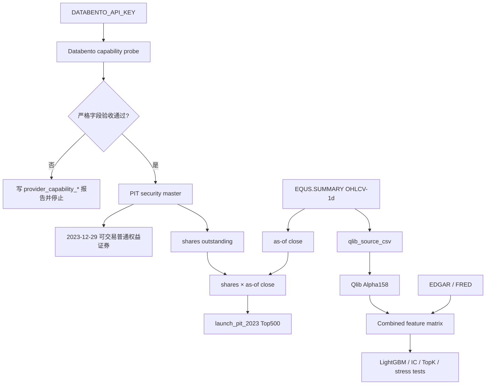

# Databento Strict Launch PIT Integration

## 目标

Databento 在本项目里承担的是“严格数据底座”的角色：替换当前 `nasdaq_public` 的股票池、证券主数据、OHLCV 和历史市值口径。

它不替代 EDGAR 和 FRED：

- Databento：股票池、证券主数据、历史行情、历史股本/市值、corporate actions。
- EDGAR：财报和估值特征。
- FRED / ALFRED：宏观状态特征。
- Qlib：把 OHLCV 转成 Alpha158，再和财报、宏观特征合并训练 LightGBM。

## 为什么需要 Databento

当前 `nasdaq_public` 的最大问题不是模型，而是股票池口径：

- 它是当前快照，缺少退市股票和历史证券状态。
- `approximate_market_cap_asof` 用当前市值反推历史市值，隐含当前 shares / 当前公司状态。
- sector / industry 来自当前 snapshot，不是历史 PIT 分类。

Databento 的 Security Master、Reference API、corporate actions 和 `EQUS.SUMMARY` 日频 OHLCV 可以用来建立更严格的 `launch_pit_2023` 股票池。但严格地说，只有 capability probe 验收通过后，才允许把它当成 strict PIT 数据源。

## 核心流程



## Capability Probe 检查什么

第一步不直接训练，而是先检查当前账号能不能拿到严格实验必需字段：

- `DATABENTO_API_KEY` 是否存在。
- Python client `databento` 是否已安装。
- Security Master 是否可访问。
- 是否有 listing / delisting date。
- 是否有 security type 和 exchange / MIC。
- 是否有 PIT shares outstanding。
- `EQUS.SUMMARY` 的 `ohlcv-1d` 是否有 open/high/low/close/volume。
- Corporate actions 是否可访问，用于后续拆股、分红和退市事件审计。

输出文件：

```text
provider_capability_summary.yaml
provider_table_columns.csv
provider_capability_report.md
```

如果 probe 不通过，脚本会停止，不会回退到 `nasdaq_public`。

## launch_pit_2023 怎么构建

默认配置：

```yaml
universe:
  mode: launch_pit_2023
  exchange: NASDAQ
  as_of_date: "2023-12-31"
  as_of_trade_date: "2023-12-29"
  top_n_by_market_cap: 500
  include_delisted: true
```

具体规则：

1. 用 Security Master 找到 2023-12-29 当时可交易的美国普通权益证券。
2. 过滤权证、基金、优先股、债券、期权等非普通权益证券。
3. 保留后来退市的证券，只要它们在 2023-12-29 当天仍可交易。
4. 用 `shares_outstanding × as-of close` 计算 `market_cap_asof`。
5. 禁止使用 `current_market_cap × asof_close / latest_close`。
6. 按 as-of 市值排序，选 Top500。

这一步解决的是“测试启动时我们当时能买哪些股票、当时市值大概是多少”，不是动态指数成分。

## 进入 Qlib 的数据是什么

Databento 输出的日线会转换成 Qlib source CSV：

```text
date,symbol,open,high,low,close,vwap,volume
```

第一版 `vwap` 仍用 OHLC 均值近似。后续如果 entitlement 提供更严格的 VWAP 或成交明细，再替换这个口径。

之后流程不变：

```text
Databento OHLCV -> Qlib Alpha158 -> EDGAR/FRED 拼接 -> LightGBM -> TopK 回测
```

## 如何运行

安装 Python client：

```bash
.venv/bin/python -m pip install databento
```

在 ignored `.env` 写入：

```bash
DATABENTO_API_KEY=your_key_here
```

运行 baseline：

```bash
.venv/bin/python -u analysis/nasdaq_top500_score/run_qlib_alpha158_lightgbm.py \
  --config analysis/nasdaq_top500_score/configs/strict/strict_databento_baseline_alpha158_edgar_5d.yaml
```

宏观直接输入：

```bash
.venv/bin/python -u analysis/nasdaq_top500_score/run_qlib_alpha158_lightgbm.py \
  --config analysis/nasdaq_top500_score/configs/strict/strict_databento_macro_direct_5d.yaml
```

默认 no-credit 宏观交互：

```bash
.venv/bin/python -u analysis/nasdaq_top500_score/run_qlib_alpha158_lightgbm.py \
  --config analysis/nasdaq_top500_score/configs/strict/strict_databento_macro_interactions_no_credit_5d.yaml
```

## 当前限制

- 当前完成的是工程接口、fake client 测试和一次真实 capability probe。
- 真实 probe 结果：当前 key 可以触达 Databento API，但 Security Master 返回 `license_reference_dataset_no_subscription`，说明账号还没有 Reference / Security Master 订阅权限。
- 因为 strict `launch_pit_2023` 必须依赖 Security Master 的 listing / delisting / shares outstanding，所以本次没有继续下载训练数据，也没有进入模型训练。
- 是否具备严格 PIT 能力，要看你的账号 entitlement 和 `provider_capability_summary.yaml`。
- 如果 Nasdaq primary listing / exchange 口径无法用 PIT 字段证明，报告必须标记 exchange 口径风险。
- PIT 行业分类第一版不进入 strict headline 模型和选股约束，只做复盘。
- 价格是否 split-adjusted、dividend-adjusted，需要在 provider probe 和后续 corporate actions audit 中继续验收。

## 下一步

1. 在 `.env` 设置 `DATABENTO_API_KEY`。
2. 安装 `databento` Python client。
3. 在 Databento portal / 订阅页确认 Reference API / Security Master entitlement。
4. 先运行 strict Databento baseline，只看 capability probe 是否通过。
5. 通过后再跑 baseline / direct macro / no-credit macro interactions 三组严格实验。
6. 如果 capability probe 不通过，根据失败项决定补 entitlement，或换更合适的数据源。

学习研究，不是投资建议。
