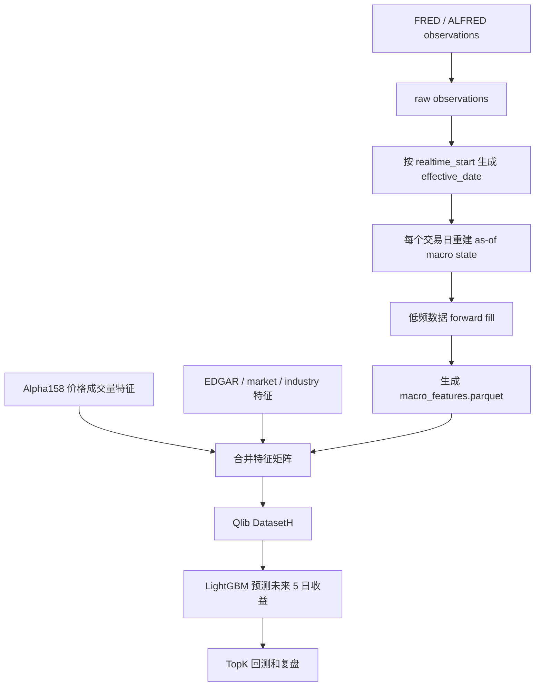

# FRED ALFRED Macro Features Integration

## 学习目标

这一阶段把宏观经济状态接入模型，但目标不是“用宏观数据直接选股票”，而是让模型知道当时处在什么市场环境里。

宏观数据回答的问题是：

```text
利率是高还是低
收益率曲线是否倒挂
通胀和就业压力是否变化
信用风险是否扩大
市场风险偏好是否恶化
油价和美元是否冲击行业利润
```

这些变量对所有股票在同一天基本相同，所以它们更像“市场状态背景”。模型最终仍然靠 Alpha158、EDGAR、行情相对特征和行业信息做横截面排序。

## FRED 和 ALFRED 是什么

FRED 是 Federal Reserve Economic Data，由 St. Louis Fed 维护，提供利率、通胀、就业、工业产出、信用利差、VIX、油价、美元指数等宏观序列。

ALFRED 是 ArchivaL Federal Reserve Economic Data，重点是历史 vintage。它能回答：

```text
在 2020-03-31 这一天，市场当时能看到的 CPI / 失业率 / 工业产出是多少？
后来修订后的最终值不能提前进入当时的模型。
```

官方入口：

- [FRED API](https://fred.stlouisfed.org/docs/api/fred/)
- [FRED series observations](https://fred.stlouisfed.org/docs/api/fred/series_observations.html)
- [ALFRED](https://alfred.stlouisfed.org/)
- [FRED API Keys](https://fred.stlouisfed.org/docs/api/fred/v2/api_key.html)

## 为什么会有未来函数风险

宏观数据经常有三个时间：

```text
observation_date：这条数据对应的经济时期
realtime_start：这条数据第一次或某次修订后可见的日期
trading_date：模型实际做预测的交易日
```

不能把 `observation_date` 当成模型可用日期。

例子：

```text
2024-03 CPI 可能对应 observation_date = 2024-03-01
但它可能到 2024-04 中旬才发布
如果在 2024-03-01 就把它喂给模型，就是未来函数
```

本项目的处理规则：

```text
1. 下载 FRED/ALFRED observations，其中包含 realtime_start / realtime_end。
2. 对每个交易日，只选 effective_date <= trading_date 的数据。
3. effective_date 默认是 realtime_start 后的下一个交易日。
4. 对月度/低频数据 forward fill，但记录 days_since_release。
5. 使用初始发布值或 vintage/as-of 值，不使用今天看到的最终修订值回填历史。
```

## 数据流



## 第一版宏观特征

| 类别 | FRED Series | 模型特征 |
|---|---|---|
| 利率水平 | `DGS10`, `DGS2`, `FEDFUNDS` | 水平、20/60 日变化、3 个月变化 |
| 收益率曲线 | `DGS10 - DGS2` | 长短端利差、倒挂标记 |
| 通胀 | `CPIAUCSL` | 水平、YoY、3 个月变化 |
| 就业 | `UNRATE` | 水平、3 个月变化 |
| 增长 | `INDPRO` | 水平、YoY、3 个月变化 |
| 信用压力 | `BAA10Y` | 水平、20/60 日变化 |
| 风险偏好 | `VIXCLS` | 水平、20 日变化、60 日 z-score |
| 商品与美元 | `DCOILWTICO`, `DTWEXBGS` | 水平、20/60 日变化 |

每个序列还会记录：

```text
macro_days_since_<name>_release
macro_<name>_observation_age_days
```

这两个特征帮助模型区分“刚发布的新数据”和“已经很久没更新的旧数据”。

## forward fill 怎么理解

宏观数据不是每天都发布。比如 CPI 是月度数据，但股票每天交易。

forward fill 的意思是：

```text
4 月 12 日 CPI 发布后
在 4 月 15 日、4 月 16 日、4 月 17 日……
模型继续使用这条已经公开的 CPI
直到下一条 CPI 发布
```

它不是把未来数据提前填回去，而是把已经公开的信息继续沿用。为了避免太旧的数据误导模型，配置里有 `max_staleness_days`。

## 模型输入方式

宏观特征最终会生成：

```text
macro_features.parquet
```

索引是：

```text
datetime, instrument
```

同一个交易日，所有股票的宏观值相同，然后和已有特征拼在一起：

```text
Alpha158
+ EDGAR 财报估值
+ market_features 行情相对特征
+ macro_features 宏观状态特征
=> LightGBM 输入
```

宏观特征不会改变标签。当前标签仍然是：

```text
Ref($close, -6) / Ref($close, -1) - 1
```

也就是预测未来 5 个交易日收益。

## 输出文件

启用宏观特征后会生成：

```text
macro_raw_observations.parquet
macro_asof_observations.parquet
macro_features.parquet
macro_failures.csv
```

含义：

```text
macro_raw_observations.parquet：FRED/ALFRED 原始 observation 和实时字段
macro_asof_observations.parquet：每个交易日当时可见的宏观状态
macro_features.parquet：广播到每只股票后的模型输入特征
macro_failures.csv：下载、解析或缺失记录
```

## 运行方式

需要先设置 FRED API key：

```bash
export FRED_API_KEY="your-fred-api-key"
export SEC_EDGAR_USER_AGENT="Your Name your-email@example.com"
```

运行宏观增强配置：

```bash
.venv/bin/python -u analysis/nasdaq_top500_score/run_qlib_alpha158_lightgbm.py \
  --config analysis/nasdaq_top500_score/configs/nasdaq_alpha158_edgar_macro_lgbm_10y_frozen_2023_top500_5d_pit_safe.yaml
```

## 当前边界

第一版只做宏观状态特征，不做宏观预测模型。

第一版默认使用 FRED `output_type: 4`，也就是 initial release only，避免最终修订值回填历史。后续如果要更完整地模拟“当时可见的最新修订”，可以进一步使用更密集的 vintage date 查询。

当前宏观变量对所有股票同日相同，所以它们的作用更像 regime feature。下一步可以研究：

```text
宏观状态 × 行业
宏观状态 × 动量
宏观状态 × 估值
宏观状态 × 利率敏感行业
```

## 遗留问题

- FRED 免费 API 有请求限制，完整跑大窗口时需要缓存。
- 月度数据的真实发布时间有时需要更细的 release calendar 才能做到分钟级严谨。
- 当前只顺延到下一个交易日，没有区分盘前、盘中、盘后发布。
- 宏观特征是否有效，要看 IC、Rank IC 和成本后回测，不看单次 Top10。

## 相关笔记

[[Data Source Upgrade Plan]]
[[SEC EDGAR Fundamentals Integration]]
[[Market Derived Relative Features]]
[[PIT Safe Backtest]]
[[Future Information Audit]]
[[Qlib Learning Log]]
[[Stage Completion Records]]
