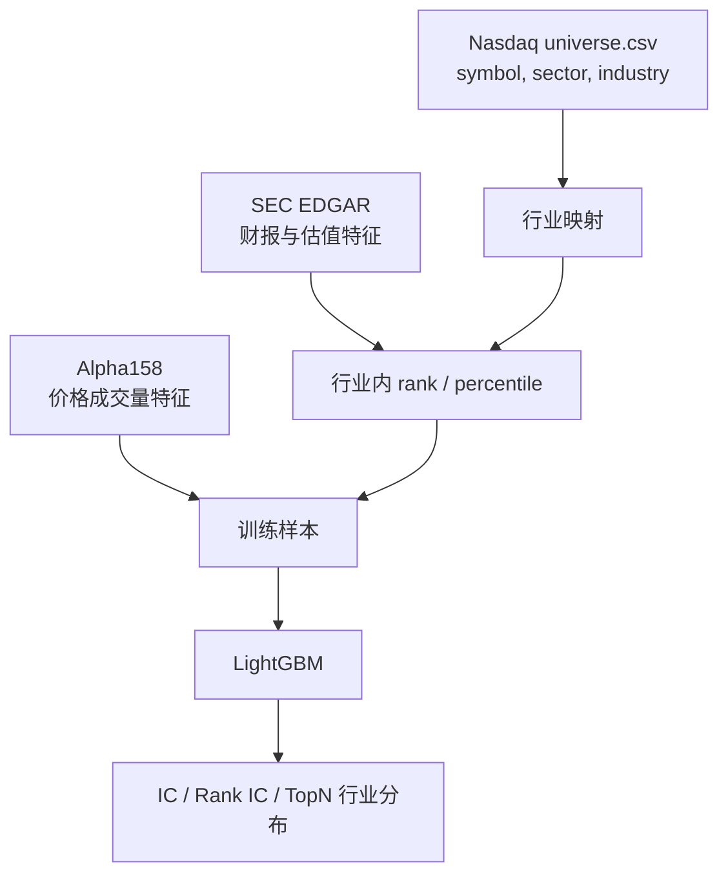

# Industry Features And Relative Ranking

## 本阶段目标

这一步把财报和估值特征从“全市场直接比较”改成“行业内比较”。

原因很简单：不同行业的商业模式差异太大。银行、芯片、软件、生物科技、公用事业的估值、毛利率、负债率和 ROE 天然不在一个尺度上。把它们直接放在一起排序，模型很容易学到“行业差异”，而不是“同一行业里谁更好”。

## 先记住一句话

```text
Alpha158 看价格行为。
EDGAR 看公司财务。
行业相对特征看“这家公司在同行里排第几”。
```

## 为什么估值要行业内比较

同样是 `price_to_sales`，软件公司和零售公司的合理区间可能完全不同。

```text
软件公司：
高毛利、轻资产、收入可扩展，市销率可能长期较高。

零售公司：
低毛利、重库存、扩张受门店和供应链约束，市销率通常较低。
```

如果直接全市场比较，模型可能把“软件行业整体高估值”误读成坏信号，或者把“低毛利行业天然低毛利”误读成公司质量差。

行业内比较要问的是：

```text
在同一个行业里，它贵不贵？
在同一个行业里，它盈利质量好不好？
在同一个行业里，它成长性靠前还是靠后？
```

## 当前进入模型的行业相对特征

第一版重点处理这些 EDGAR 特征：

```text
edgar_price_to_sales
edgar_price_to_book
edgar_price_to_earnings
edgar_gross_margin
edgar_net_margin
edgar_roe
edgar_revenue_yoy_growth
edgar_liabilities_to_assets
```

它们会生成类似这样的模型输入：

```text
industry_rank_price_to_sales
industry_pct_price_to_sales
sector_pct_price_to_sales
industry_rank_roe
industry_pct_roe
sector_pct_roe
```

`rank` 是名次，`pct` 是百分位。百分位更适合跨行业进入模型，因为它把不同量纲压到大致相同的 0 到 1 区间。

## Rank、Percentile、行业中性化的区别

### Rank

Rank 是行业内名次。

```text
行业内 5 家公司，ROE 从低到高排名：
1, 2, 3, 4, 5
```

它告诉模型“谁更靠前”，但不直接说明行业里一共有多少家公司。

### Percentile

Percentile 是行业内百分位。

```text
行业内 5 家公司，最高 ROE 的 percentile = 1.0
最低 ROE 的 percentile = 0.2
```

它比 rank 更容易被模型使用，因为 10 家公司的第 5 名和 100 家公司的第 5 名含义不同。

### 行业中性化

行业中性化不是新增一个特征，而是控制组合暴露。

```text
行业相对特征：告诉模型同行里谁更好。
行业中性化：限制最终组合不要押注单一行业。
```

本阶段只做“模型输入特征”，还没有做组合层面的行业权重约束。组合约束会放到后续 TopK / 回测阶段。

## 当前数据口径

第一版行业分类来自当前 Nasdaq public 股票池里的：

```text
sector
industry
```

这适合学习行业内比较，但有一个重要限制：

```text
它不是历史 PIT 行业分类。
```

也就是说，今天看到的行业分类可能被用于过去样本。严格研究中，行业分类也应该按历史时间点生效，例如使用历史 GICS、SIC、NAICS 或供应商提供的 PIT 行业分类。

## 特征生成流程



## 为什么要保留 sector fallback

有些行业样本太少，例如某个细分行业只有 1 只股票。此时行业内排名没有统计意义。

第一版规则：

```text
优先按 industry 比较。
如果 industry 当天样本数太少，回退到 sector 比较。
```

这不是完美方案，但比硬算一个只有 1 只股票的行业百分位更合理。

## 如何解读报告

行业增强实验的报告会新增：

```text
行业特征数量
行业分类失败数量
sector 缺失数量
industry 缺失数量
TopN sector 分布
TopN industry 分布
```

重点不是只看 Top5 分数，而是看：

```text
模型是否仍集中押注某一个行业？
加入行业相对特征后，IC / Rank IC 是否改善？
TopN 的行业分布是否更合理？
```

## 当前限制

```text
行业分类不是 PIT
没有使用 GICS / SIC / NAICS 历史分类
没有做组合行业权重限制
没有处理行业分类变更
没有验证行业特征是否真实提升成本后收益
```

所以本阶段结论只能回答：

```text
行业内相对财报估值特征是否能作为模型输入。
```

还不能回答：

```text
行业中性组合是否更赚钱。
```

## 下一步

后续应进入组合层面的行业控制：

```text
1. Alpha158 baseline
2. Alpha158 + EDGAR
3. Alpha158 + EDGAR + 行业相对特征
4. 行业内 TopK / sector 权重限制回测
5. 对比年化收益、最大回撤、换手率、成本后收益
```

相关笔记：

[[SEC EDGAR Fundamentals Integration]]
[[Financial Valuation Industry Macro News]]
[[Industry Neutralization]]
[[TopK Strategy]]
[[Backtest And Costs]]
