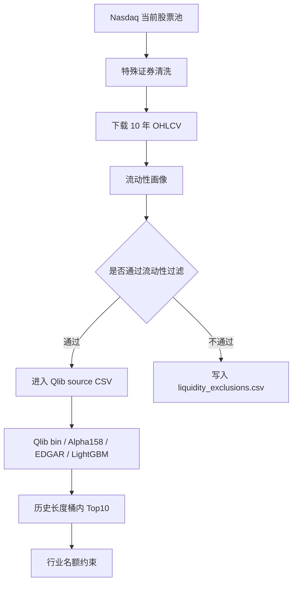

# Liquidity Filtering

## 学习目标

理解为什么“模型觉得好”的股票，不一定适合进入最终候选组合。

流动性过滤回答的是：

```text
这只股票能不能比较顺畅地买入和卖出？
模型分数是否可能来自极少成交、价格跳动或报价异常？
这个候选是否会在真实交易中被滑点和冲击成本吞掉？
```

## 为什么要做

Alpha158、EDGAR、行业特征解决的是“预测信号”。流动性过滤解决的是“能不能交易”。

如果不做流动性过滤，最终 Top10 可能包含：

```text
成交额很小的股票
价格低于 1 美元的股票
最近交易不连续的股票
零成交天数较多的股票
```

这些股票在模型里可能有分数，但真实买卖时会遇到更高滑点、更宽买卖价差和更强冲击成本。

## 本次过滤规则

第一版只使用当前已有日线 OHLCV，不引入新的数据源。

默认规则：

```text
最新收盘价 >= 1 美元
近 20 日平均成交额 >= 500 万美元
近 60 日成交额中位数 >= 200 万美元
近 60 日零成交比例 <= 5%
近 60 日至少有 40 个交易日数据
```

成交额计算：

```text
dollar_volume = vwap * volume
```

当前 `vwap` 是 OHLC 均值近似：

```text
vwap = (open + high + low + close) / 4
```

所以这不是交易所真实 VWAP，只是学习实验中的成交额近似口径。

## 在流水线中的位置

流动性过滤发生在下载日线之后、转换 Qlib bin 之前。



这意味着被过滤的股票不会进入本次训练、预测和最终 Top10。

## 输出文件

```text
liquidity_profile.csv
liquidity_exclusions.csv
```

`liquidity_profile.csv` 记录每只已下载股票的流动性画像：

```text
rows
first_date
last_date
latest_close
avg_dollar_volume_20d
avg_dollar_volume_60d
median_dollar_volume_60d
zero_volume_days_60d
zero_volume_ratio_60d
recent_trading_days_60d
liquidity_pass
exclusion_reason
```

`liquidity_exclusions.csv` 记录被剔除股票和剔除原因。

## 如何影响模型和排名

流动性过滤不生成模型特征，也不改变标签。

它的影响在股票池层面：

```text
过滤前：所有清洗后股票都可能进入 Qlib 训练和预测
过滤后：只有流动性达标股票进入 Qlib 训练和预测
```

所以它影响的是“模型能看到哪些股票”和“最终 Top10 从哪些股票里选”，不是改变 LightGBM 对单只股票的打分公式。

## 当前限制

第一版流动性过滤仍然很粗：

```text
没有真实 bid-ask spread
没有分钟级成交数据
没有订单簿深度
没有真实冲击成本估计
没有按组合规模估算容量
```

但它已经能过滤掉明显不适合学习候选组合的低价、低成交额和交易不连续股票。

## 本次实验结果

运行配置：

```text
analysis/nasdaq_top500_score/configs/nasdaq_alpha158_edgar_lgbm_10y_clean_bucket_top10.yaml
```

本次流动性过滤结果：

```text
生成流动性画像股票数：482
流动性剔除数量：4
进入 Qlib 数据股票数：478
```

剔除原因：

```text
近 20 日平均成交额低于 500 万美元：3 只
近 60 日成交额中位数低于 200 万美元：1 只
```

被剔除股票：

```text
LBTYB
MAAS
RGC
VFS
```

证券主数据和流动性过滤后的最新 Top10：

```text
AAOI
IBRX
LUNR
AXTI
FLEX
SNDK
CELC
QS
CORZ
LQDA
```

本次 Test 日均 IC 为 `-0.000519`，Rank IC 为 `0.001712`。这不是模型能力变差或变好的直接结论，只说明在加入证券主数据和流动性过滤后，股票池和横截面样本发生了变化。

## 下一步

进入第 4 条：未来 5 日收益标签。

目标是把当前 1 日收益标签改成更平滑的 5 日收益标签，并对比 IC、Rank IC 和 Top10 稳定性。

相关笔记：

[[Stock Pool Cleaning And History Buckets]]
[[Security Master Data]]
[[Portfolio Risk Control]]
[[Backtest And Costs]]
[[Data Scope And Sources]]
[[Stage Completion Records]]
