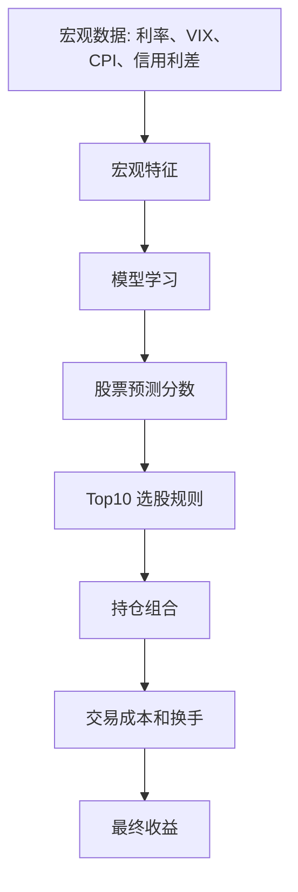

# Macro Features New Information And Return Degradation

这篇笔记回答一个非常关键的问题：

```text
宏观特征明明提供了新信息，为什么加入模型后，年化收益反而下降？
```

这个问题很重要，因为它能帮助我们区分两件事：

```text
数据有没有信息
信息能不能变成策略收益
```

在量化研究里，这两件事经常不是一回事。

## 先给结论

宏观特征确实提供了新信息，但第一版直接拼进模型后，没有稳定转化成 TopK 选股收益。

本次实验现象是：

```text
Rank IC 提升
beta 降低
最大回撤降低
但累计收益、年化收益、超额收益下降
```

这说明宏观特征不是完全没用。它更像是在告诉模型“当前市场处于什么状态”，从而让组合变得更保守；但它没有很好地帮助模型选出未来 5 个交易日涨幅最高的股票。

更准确的判断是：

```text
宏观信息是 regime information，不天然等于 stock selection alpha。
```

## Beta 是什么

Beta 衡量的是策略对市场或基准的敏感度。

可以把它理解成：

```text
市场涨跌 1%，策略通常跟着动多少。
```

更正式一点：

```text
beta = 策略收益与基准收益的协方差 / 基准收益的方差
```

但学习时先记住直觉就够了：

```text
beta = 市场暴露
```

几个例子：

```text
beta = 1.0：策略和市场弹性差不多
beta = 1.2：市场涨时更容易多涨，市场跌时也更容易多跌
beta = 0.8：市场涨时通常少涨，市场跌时也可能少跌
beta = 0：策略和市场涨跌关系不明显
beta < 0：策略可能和市场反向
```

所以 beta 不是“策略好坏”的直接判断，而是回答：

```text
你的收益有多少来自市场大方向？
```

如果一个策略收益很高，但 beta 也很高，可能只是因为它在牛市里买了更高弹性的股票。这个收益未必来自模型选股能力。

这时要看 alpha。

```text
alpha = 扣掉 beta 能解释的市场收益后，策略剩下的收益
```

因此：

```text
高收益 + 高 beta：可能是市场涨带来的
高收益 + 低 beta + 正 alpha：更像策略自身有效
低 beta + 低回撤：可能更稳，但不一定赚得多
```

本次宏观增强实验里：

```text
无宏观 baseline beta 约 1.04
宏观增强 beta 约 0.81
```

这说明宏观特征让组合更保守，市场上涨时弹性下降。它降低了风险暴露，但也可能在强势市场里拖累年化收益。

## IC 和 Rank IC 是什么

IC 是 Information Coefficient，衡量的是模型预测分数和未来真实收益之间的相关性。

每天计算一次：

```text
IC_t = Corr(当天所有股票的模型分数, 这些股票未来收益)
```

比如某天有 500 只股票：

```text
模型给 500 只股票各打一个 score
5 天后，每只股票都有真实收益
IC 就看 score 高的股票，未来收益是否也更高
```

Rank IC 是把分数和收益都转成排名后再算相关性：

```text
Rank IC_t = Corr(当天所有股票的模型分数排名, 这些股票未来收益排名)
```

两者侧重点不同：

```text
IC：更看重分数大小和收益大小的线性关系
Rank IC：更看重排序是否对
```

对 TopK 选股来说，Rank IC 通常更贴近策略，因为 TopK 主要关心：

```text
排在前面的股票是不是更好？
```

但 IC / Rank IC 仍然只是第一层验证。它们回答的是：

```text
模型分数有没有预测关系？
```

它们不直接回答：

```text
最终组合是否赚钱？
是否跑赢基准？
是否能覆盖交易成本？
收益是不是来自少数股票或行业押注？
```

## 新信息到收益之间隔了很多层

一条数据要真正变成策略收益，中间要经过很多关。



宏观数据只是在第一步提供了新信息。后面任何一层没有处理好，最终收益都可能下降。

比如：

```text
模型学错了宏观和个股特征之间的关系
预测分数整体排序改善，但 Top10 头部选股变差
组合 beta 降低，在上涨市场里少赚
宏观特征降低回撤，但没有提高超额收益
交易成本和换手吞掉了改善
```

所以不能只问：

```text
宏观特征有没有信息？
```

还要问：

```text
宏观特征有没有改善当前这个标签、模型、选股规则和测试期下的策略结果？
```

## 为什么宏观特征不天然适合横截面选股

我们当前做的是横截面选股。

也就是在同一个交易日，从 500 只股票里排序：

```text
今天买哪 10 只？
```

但宏观特征有一个特殊点：

```text
同一天，所有股票看到的宏观值是一样的。
```

例如某一天：

```text
10 年期美债利率 = 4.5%
VIX = 18
CPI YoY = 3.2%
收益率曲线倒挂
```

这些值对 Apple、Microsoft、Tesla、Nvidia、Costco 都一样。

所以宏观特征本身不能直接回答：

```text
Apple 今天为什么应该排在 Microsoft 前面？
```

它更适合回答：

```text
在高利率环境下，哪些类型的股票信号更可靠？
在 VIX 上升时，动量是否更容易失效？
在信用利差扩大时，亏损公司是否更危险？
在收益率曲线倒挂时，金融股是否需要降低权重？
```

这就是宏观特征的本质：

```text
它不是直接排序变量，而是条件变量。
```

## 宏观特征真正有用的方式是交互

宏观特征单独看，可能对所有股票一样。

但它和其他特征结合时，就可能有意义。

例子：

```text
高利率 × 高估值
```

含义：

```text
高利率环境下，未来现金流折现率上升，高估值成长股可能更脆弱。
```

例子：

```text
VIX 上升 × 短历史股票
```

含义：

```text
风险偏好下降时，市场可能更不愿意持有历史短、流动性弱、确定性低的股票。
```

例子：

```text
信用利差扩大 × 亏损公司
```

含义：

```text
融资环境恶化时，亏损公司和现金流差的公司可能更容易被杀估值。
```

例子：

```text
收益率曲线倒挂 × Finance
```

含义：

```text
银行和金融公司可能受到利差环境影响，但不同金融子行业反应也不一样。
```

所以更合理的宏观用法不是简单加入：

```text
VIX
10Y 利率
CPI
```

而是加入：

```text
VIX × 动量
VIX × 波动率
利率水平 × 高估值
利率变化 × Technology
信用利差 × 亏损公司
收益率曲线 × Finance
美元走强 × 跨国收入暴露
油价变化 × Energy / Industrials / Consumer Discretionary
```

## 为什么 Rank IC 提升了，收益却下降了

这次结果里，一个容易让人困惑的地方是：

```text
Rank IC 提升
TopK 收益下降
```

这不矛盾。

Rank IC 衡量的是：

```text
每天整个股票池里，模型排序和未来收益排序的相关性。
```

但 TopK 策略只关心：

```text
最前面的 10 只股票到底选得好不好。
```

一个模型可能让整体排序稍微更平滑、更合理，但把少数最强赢家挤出了 Top10。

举个简化例子：

```text
baseline 排序：
第 1 名是大赢家
第 2 名是大赢家
第 3 名是普通股票
整体排序一般

macro 排序：
整体前 500 排得更平滑
但第 1-10 名少了几个爆发性赢家
```

那么可能出现：

```text
Rank IC 提升
Top10 收益下降
```

这就是为什么不能只看 IC，也不能只看收益曲线。两者要一起看。

## 收益高但 IC 低，是否只是恰巧赚钱

可以这么怀疑，但不能直接下结论。

更准确地说：

```text
IC 低 + 收益高 = 高收益需要进一步验明来源
```

它可能是运气，也可能不是。

常见来源包括：

```text
1. 少数几只股票贡献了大部分收益
2. 策略押中了某个强势行业
3. 策略吃到了市场 beta
4. Top10 头部选股不错，但全市场整体排序一般
5. 测试期刚好适合这个策略
6. 交易成本、流动性或回测约束没有完全反映真实情况
7. 存在数据口径问题或未来函数
```

所以不能简单说：

```text
IC 低，所以收益就是运气。
```

应该说：

```text
IC 低会降低我们对高收益可重复性的信心。
```

接下来要做归因：

```text
收益是不是来自 beta？
收益是不是来自行业暴露？
收益是不是集中在少数股票？
每个月都有效，还是只在少数阶段有效？
不同 market regime 下是否仍然有效？
Top10 内部是否真的排序有效？
```

如果这些检查显示：

```text
收益分布分散
alpha 为正
行业暴露可控
不同阶段都有效
没有未来函数
```

那么即使 IC 不高，也不能说它只是运气。

但如果检查显示：

```text
收益靠一两只股票
beta 很高
行业高度集中
只在某个短阶段赚钱
换一个市场状态就失效
```

那高收益更可能是偶然或特定行情产物。

## 为什么 beta 降低会让年化收益下降

这次宏观增强模型有一个明显变化：

```text
beta 从大约 1.04 降到大约 0.81
最大回撤也下降
```

这说明宏观特征让组合更保守了。

在下跌市场里，这可能是好事。

但在 2024-2026 这种偏强势的测试期里，降低 beta 往往意味着：

```text
市场上涨时，组合弹性变小
大盘涨很多，组合涨得少
回撤小了，但收益也少了
```

所以年化收益下降，不一定说明宏观特征完全错误。它可能说明：

```text
宏观特征把组合推向了更低风险、更低弹性的股票。
```

问题在于，我们当前目标不是只降低风险，而是要在控制风险的同时保住超额收益。

这次没有做到。

## 为什么宏观关系容易不稳定

宏观数据还有一个难点：关系会变。

训练期里，模型可能学到：

```text
利率上行时，某类股票表现更好
```

但测试期可能变成：

```text
利率上行已经被市场提前计价
或者市场关注点从利率切换到 AI、盈利、政策、流动性
```

宏观变量的含义并不是固定不变的。

同样是高利率：

```text
如果经济强，高利率可能代表增长强
如果经济弱，高利率可能代表压制估值
如果通胀高，高利率可能代表政策收紧
如果通胀回落，高利率可能只是历史水平偏高
```

这就是宏观特征的麻烦之处：

```text
它有信息，但信息含义依赖市场叙事和阶段。
```

所以直接把宏观变量丢进模型，模型可能学到的是过去阶段的关系，而不是未来阶段稳定有效的关系。

## 为什么 5 日收益标签可能不适合部分宏观变量

当前标签是未来 5 个交易日收益。

这对价格、动量、短期波动、流动性这些特征比较自然。

但很多宏观变量是慢变量：

```text
CPI
失业率
工业产出
联邦基金利率
```

它们可能影响的是：

```text
1-3 个月的市场风格
一个季度的行业轮动
更长期的估值中枢
```

不一定能稳定预测未来 5 个交易日收益。

因此可能出现：

```text
宏观数据确实重要
但和当前 5 日标签不匹配
```

这不是数据错了，而是预测目标和数据频率不完全匹配。

## 当前实验应该怎么理解

本次真实宏观增强实验可以这样解读：

```text
宏观数据接入成功
PIT 口径基本受控
宏观特征覆盖率足够
Rank IC 有改善
风险暴露下降
但 TopK 收益、超额收益和 alpha 下降
```

因此，当前结论不是：

```text
宏观特征没用
```

而是：

```text
第一版宏观特征的直接拼接方式，不适合作为当前 Top10 策略的默认增强。
```

换句话说：

```text
宏观变量可以保留，但不应该未经进一步验证就默认进入主模型。
```

## Regime 是什么

Regime 可以理解成市场状态、市场环境、市场阶段。

它不是某一只股票自己的特征，而是整个市场共同面对的背景。

例如：

```text
高 VIX regime：市场恐慌或波动较高
低 VIX regime：市场平稳、风险偏好较强
利率上行 regime：资金成本上升，估值可能承压
利率下行 regime：折现率下降，成长股可能受益
收益率曲线倒挂 regime：市场可能担心经济放缓
信用利差扩大 regime：融资压力上升，亏损公司可能更脆弱
美元走强 regime：跨国收入和商品价格可能受影响
油价上涨 regime：能源受益，但消费和部分工业成本承压
```

Regime 的重点是：

```text
同一个股票信号，在不同市场状态下可能有效性不同。
```

比如同样是高估值科技股：

```text
低利率 + 风险偏好强：可能继续上涨
高利率 + VIX 上升：可能被杀估值
```

同样是高动量股票：

```text
低波动市场：动量可能延续
高波动市场：动量可能快速反转
```

所以宏观数据最自然的作用不是直接告诉我们买哪只股票，而是告诉我们：

```text
现在处于什么市场状态？
在这个状态下，哪些因子应该更可信？
哪些因子应该打折？
哪些行业或股票类型风险更大？
```

## 下一步应该做什么

我建议下一步分三层做。

### 第一步：宏观 regime 复盘

先不急着改模型，先把测试期按宏观状态拆开。

例如：

```text
高 VIX vs 低 VIX
VIX 上升 vs VIX 下降
高利率 vs 低利率
利率上行 vs 利率下行
收益率曲线倒挂 vs 非倒挂
信用利差扩大 vs 收窄
美元走强 vs 走弱
油价上涨 vs 下跌
```

然后分别看：

```text
baseline 在这些状态下表现如何
macro enhanced 在这些状态下表现如何
哪些状态下宏观特征有帮助
哪些状态下宏观特征拖累收益
```

目标是回答：

```text
宏观特征到底在哪些市场环境里有价值？
```

### 第二步：宏观特征 ablation

不要一次性加入所有宏观变量。

应该拆成几组单独测试：

```text
只加利率和收益率曲线
只加 VIX
只加信用利差
只加通胀、就业、增长
只加油价和美元
```

这样可以判断：

```text
是哪一组宏观变量有帮助
是哪一组宏观变量在拖累
```

如果一组变量稳定拖累，就不应该继续放进主模型。

### 第三步：做宏观交互特征

这是最重要的一步。

可以先做少量明确、有经济含义的交互，而不是大规模乱乘。

优先候选：

```text
利率水平 × 估值分位
利率变化 × Technology 暴露
VIX 水平 × 动量
VIX 变化 × 波动率
信用利差 × 亏损公司
信用利差 × 现金流质量
收益率曲线 × Finance
油价变化 × Energy / Industrials / Consumer Discretionary
美元变化 × 大型跨国科技股
```

交互特征的目标是让模型知道：

```text
宏观状态改变时，哪些个股特征应该被放大，哪些应该被削弱。
```

## 判断是否继续使用宏观特征的标准

后续不能只看年化收益，也不能只看 IC。

建议用一组判断标准：

```text
Rank IC 是否稳定提高
TopK 收益是否提高
超额收益是否提高
最大回撤是否下降
beta 是否下降但 alpha 没有明显损失
行业暴露是否更合理
不同宏观 regime 下是否更稳
是否只是降低风险，而不是创造 alpha
```

如果宏观交互特征出现这种结果：

```text
收益略低
但回撤大幅下降
信息比率提高
超额收益仍为正
```

那它仍然可能值得保留。

如果出现这种结果：

```text
Rank IC 提高
收益下降
超额收益转负
alpha 下降
```

那就说明它更适合作为风险复盘变量，而不是主模型输入。

## 当前推荐结论

目前最稳妥的结论是：

```text
宏观特征已经具备工程接入价值。
但第一版直接拼接没有证明策略收益价值。
下一步应从 regime 复盘和少量经济含义明确的交互特征开始。
```

我不会建议现在继续盲目加入更多宏观序列。

更好的路线是：

```text
先解释宏观变量在哪些市场状态下有用
再把它转成可解释的交互特征
最后再决定是否进入默认主模型
```

## 相关笔记

[[FRED ALFRED Macro Features Integration]]
[[FRED ALFRED Macro Experiment Review]]
[[Market Derived Relative Features]]
[[IC And Rank IC]]
[[TopK Strategy]]
[[PIT Safe Backtest]]
[[Future Information Audit]]
