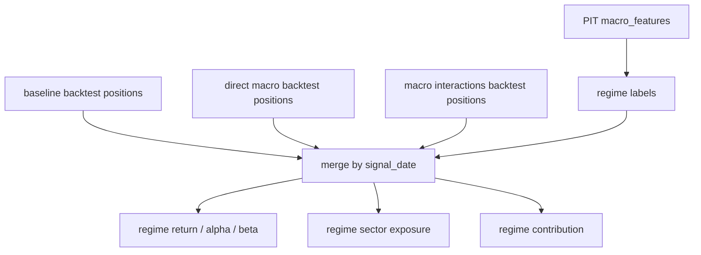

# Macro Regime Review And Interaction Features

这一步要解决一个关键误区：宏观数据不是天然的选股因子。

宏观变量通常对同一天所有股票都一样，例如 VIX、10 年美债利率、信用利差、美元指数。它直接进入模型时，更多是在告诉模型“现在是什么市场环境”，而不是直接告诉模型“今天哪只股票更好”。所以宏观数据更适合先做两件事：

1. 用来复盘：在不同市场状态下，模型收益、回撤、beta、alpha 是否不同。
2. 用来交互：把宏观状态乘到估值、动量、行业、杠杆、现金等股票差异上，让它变成横截面信息。

## 目标

本阶段回答两个问题：

- 宏观特征在哪些 regime 下有帮助，哪些 regime 下拖累收益。
- 宏观状态怎样转成真正影响个股排序的模型输入。

本阶段不改变股票池、训练期、测试期、标签和回测口径。默认仍使用：

- as-of 2023-12-31 近似冻结 Nasdaq Top500。
- 2016-05-17 到 2026-05-17 的固定 10 年窗口。
- 未来 5 日收益标签。
- 2024-01-02 到 2026-05-15 测试期。
- `sector_cap_2_top10` 作为主回测对照。

## Regime 是什么

`regime` 可以理解为市场状态。

例如同样一个股票信号，在低 VIX 的平稳市场里有效，在高 VIX 的恐慌市场里可能失效；同样是高估值成长股，在利率下行环境可能更容易被市场接受，在利率上行环境可能被压估值。

本阶段默认复盘这些 regime：

| Regime | 含义 | 例子 |
|---|---|---|
| `vix_level` | 市场波动/恐慌水平 | high VIX、low VIX |
| `vix_trend` | 波动是否上升 | VIX 20 日变化为正 |
| `rate_level` | 10 年美债利率高低 | 高利率、低利率 |
| `rate_trend` | 利率是否上行 | 10 年利率 20 日变化为正 |
| `curve_inversion` | 收益率曲线是否倒挂 | 10Y - 2Y < 0 |
| `credit_stress` | 信用压力高低 | BAA10Y 信用利差高 |
| `dollar_trend` | 美元是否走强 | 美元指数 20 日涨跌 |
| `oil_trend` | 油价是否上涨 | WTI 20 日涨跌 |

高低阈值只使用测试期之前的历史分位数估计，不能用整个测试期分布反推阈值，否则会引入未来信息。

## Regime 复盘怎么做

Regime 复盘不重新训练模型。它只读取已有回测结果：

- 无宏观 baseline。
- direct macro 模型。
- macro interactions 模型。

然后按每个 `signal_date` 当天已经可见的宏观特征打标签，再统计不同 regime 下的收益、回撤、alpha、beta、行业暴露和贡献。



重点不是只看哪组总收益最高，而是看：

- direct macro 是否只是降低 beta。
- macro interactions 是否在高 VIX、利率上行、信用压力环境下改善回撤。
- 哪些 regime 下宏观模型比 baseline 更差。
- 行业暴露是否在某些 regime 下过度集中。

## 宏观交互特征是什么

宏观交互特征就是：

```text
宏观状态 × 股票差异
```

例如：

```text
VIX 高低 × 行业内动量
利率上行 × 市销率
信用利差扩大 × 负债率
收益率曲线倒挂 × Finance sector flag
美元走强 × Technology sector flag
```

这样做的原因是：单独的 VIX 对所有股票一样，不能区分 A 股票和 B 股票；但 `VIX × 行业内动量` 会因为每只股票动量不同而不同，于是它可以参与横截面排序。

## 第一版交互特征

第一版只做少量有经济含义的交互，不做大规模自动特征交叉。

| 交互特征 | 想表达的假设 |
|---|---|
| `macro_vix_zscore_60d × market_sector_pct_momentum_20d` | 高波动环境下，行业内强动量是否更可靠 |
| `macro_vix_change_20d × market_sector_pct_volatility_20d` | 波动上升时，高波动股票是否更危险 |
| `macro_dgs10 × edgar_price_to_sales` | 高利率是否压制高 PS 股票 |
| `macro_dgs10_change_20d × edgar_price_to_book` | 利率上行是否压制高 PB 股票 |
| `macro_baa10y_credit_spread_change_20d × edgar_liabilities_to_assets` | 信用压力上升时，高负债股票是否更脆弱 |
| `macro_baa10y_credit_spread × edgar_cash_to_assets` | 信用压力高时，现金充足是否有保护作用 |
| `macro_yield_curve_10y_2y_inverted × Finance flag` | 曲线倒挂对金融行业是否特殊 |
| `macro_dgs10_change_20d × Technology flag` | 利率上行对科技股估值是否特殊 |
| `macro_wti_oil_pct_change_20d × Energy/Industrials flag` | 油价上涨对能源/工业是否有区别 |
| `macro_broad_dollar_index_pct_change_20d × Technology flag` | 美元走强对科技股海外收入/估值是否有影响 |

## 模型输入怎么变

Baseline 输入：

```text
Alpha158 + EDGAR + market_features
```

Direct macro 输入：

```text
Alpha158 + EDGAR + market_features + raw macro
```

Macro interactions 输入：

```text
Alpha158 + EDGAR + market_features + macro interaction features
```

注意：macro interactions 配置中 `macro_features.append_to_model: false`，也就是原始宏观变量只用于生成交互项，不直接进入 LightGBM。

## 输出文件

本阶段新增这些输出：

```text
macro_interaction_features.parquet
macro_interaction_failures.csv
macro_regime_daily_metrics.csv
macro_regime_summary.csv
macro_regime_strategy_comparison.csv
macro_regime_sector_exposure.csv
macro_regime_contribution_summary.csv
macro_regime_review_summary.yaml
```

最终报告看：

```text
analysis/nasdaq_top500_score/runs/nasdaq_alpha158_edgar_macro_interactions_lgbm_10y_frozen_2023_top500_5d_pit_safe/report.md
```

## 真实实验结果

本次实验已经完成，`macro_interaction_features.parquet` 生成：

```text
行数：1,256,500
交互特征数：10
失败记录：0
平均非空覆盖率：80.73%
```

三组主对照结果如下，均使用 `sector_cap_2_top10`：

| 模型 | IC | Rank IC | 累计收益 | 年化收益 | 最大回撤 | 超额累计收益 | 年化 Alpha | Beta |
|---|---:|---:|---:|---:|---:|---:|---:|---:|
| Baseline | 0.016978 | 0.003683 | 97.56% | 33.75% | -29.36% | 10.51% | 7.88% | 1.042 |
| Direct macro | 0.012456 | 0.009214 | 53.92% | 20.23% | -22.92% | -13.90% | 1.20% | 0.813 |
| Macro interactions | 0.022432 | 0.012953 | 133.12% | 43.55% | -24.19% | 30.39% | 17.16% | 0.922 |

第一版结果很清楚：

- direct macro 提高了 Rank IC、降低 beta 和最大回撤，但收益和 alpha 明显弱于 baseline。
- macro interactions 同时提高 IC、Rank IC、累计收益、年化收益、超额收益和 alpha，并且 beta 低于 baseline。
- macro interactions 的最大回撤比 direct macro 略大，但仍好于 baseline。

这说明：宏观变量不适合只是作为 raw macro 直接喂给模型；把它和行业、估值、动量、波动率、杠杆、现金等股票差异结合后，更容易变成横截面选股信息。

## Regime 复盘结果

本次 regime 摘要默认过滤低样本状态：best/worst 列表至少需要 5 个调仓期。`credit_stress=mid_credit_stress` 只有 1 个调仓期，所以不进入主结论。

Macro interactions 相对 baseline 表现最好的状态：

| Regime | 调仓期数 | 年化收益差 | Alpha 差 | Beta 差 | 最大回撤差 |
|---|---:|---:|---:|---:|---:|
| high VIX | 18 | +79.46% | +57.27% | -0.201 | +3.78% |
| VIX rising | 64 | +29.15% | +22.24% | -0.074 | +10.68% |
| mid VIX | 82 | +21.47% | +15.95% | -0.026 | +1.64% |
| rates flat/falling | 62 | +21.12% | +13.21% | +0.046 | +1.94% |
| curve not inverted | 85 | +19.62% | +16.89% | -0.099 | +5.17% |

Macro interactions 相对 baseline 表现最弱的状态：

| Regime | 调仓期数 | 年化收益差 | Alpha 差 | Beta 差 | 最大回撤差 |
|---|---:|---:|---:|---:|---:|
| low VIX | 18 | -65.44% | -41.00% | -0.709 | -2.36% |
| curve inverted | 33 | -17.48% | -8.84% | -0.217 | -3.03% |
| VIX flat/falling | 54 | -14.06% | -5.18% | -0.172 | +2.52% |
| dollar stronger | 50 | -12.20% | +8.19% | -0.331 | +7.78% |
| rates rising | 56 | -2.22% | +4.42% | -0.241 | +0.59% |

这里的“最大回撤差”是相对 baseline 的差值，正数表示回撤更浅，负数表示回撤更深。

当前解释：

- 高 VIX 和 VIX 上升环境下，macro interactions 明显优于 baseline，说明波动状态和股票动量/波动/行业的交互有用。
- 低 VIX 环境下，macro interactions 明显弱于 baseline，说明宏观交互可能让模型在平稳市场中过度保守。
- 收益率曲线倒挂下表现偏弱，说明当前交互可能还没有正确刻画倒挂环境里的行业和估值影响。
- 美元走强时收益差为负但 alpha 差为正，说明组合可能降低了市场暴露，但收益来源需要进一步看行业贡献。

## 判断标准

如果 macro interactions 同时提升：

- Rank IC。
- `sector_cap_2_top10` 累计收益。
- 年化 alpha。
- 高压力 regime 下回撤。

那么宏观交互可以进入默认主模型候选。

如果收益不如 baseline，但回撤明显下降、beta 更低、超额仍为正，它更像风险增强特征。

如果收益、alpha、Rank IC 都没有改善，宏观数据暂时只保留为复盘维度，不进入默认主模型。

## 风险与限制

- 当前行业分类来自 Nasdaq public snapshot，不是历史 PIT 行业分类。
- FRED/ALFRED 宏观数据已经按 as-of 和下一交易日生效处理，但日频市场型序列仍要注意发布时间差异。
- 交互特征数量少，第一版只验证方向，不追求一次性最优。
- 宏观变量很容易解释事后结果，但能否提前改善选股，需要看严格回测。

## 下一步

下一步已进入宏观交互 ablation：一次去掉一类交互，观察 IC、Rank IC、TopK、alpha/beta 和 high VIX/low VIX regime 是否变化。优先检查：

- VIX 交互是否贡献了主要收益。
- 利率 × 估值交互是否在 low VIX 或曲线倒挂状态下拖累。
- 美元 × Technology 和油价 × Energy/Industrials 是否只是行业暴露代理。

相关笔记：

- [[FRED ALFRED Macro Features Integration]]
- [[FRED ALFRED Macro Experiment Review]]
- [[Macro Features New Information And Return Degradation]]
- [[Macro Interaction Ablation Review]]
- [[Industry Exposure Strategy Comparison]]
