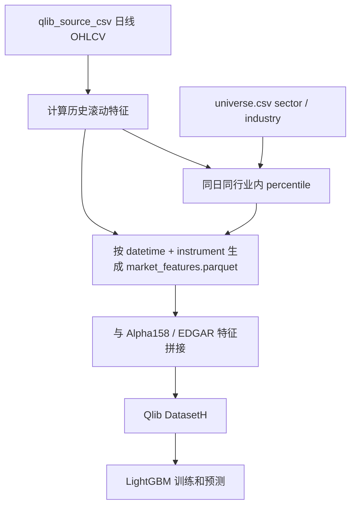

# Market Derived Relative Features

## 目标

把 5.7C 错误复盘里发现的线索转成模型输入：

```text
模型漏掉了更大、更活跃、近期动量更强的赢家
模型容易给短历史、高波动股票过高分数
```

阶段 5.8B 的做法是新增一层日频 PIT 行情派生特征，并计算它们在 sector / industry 内部的相对位置。

## 为什么不是直接加市值

当前 Nasdaq public 数据源没有历史 shares outstanding，所以不能严谨生成每天的真实 PIT 市值。

如果用今天的 shares 或运行日市值回填过去，会把未来信息放进训练集。这样模型可能看似变强，但实际是数据泄漏。

因此第一版不直接加入历史市值，而是加入更安全的替代特征：

```text
价格水平
成交额
流动性
近期动量
近期波动率
截至当日的历史长度
```

这些都可以从截至当日的 OHLCV 数据计算，不需要未来数据。

## 新增特征

原始日频特征：

```text
market_log_close
market_dollar_volume
market_log_avg_dollar_volume_20d
market_log_avg_dollar_volume_60d
market_log_median_dollar_volume_20d
market_log_median_dollar_volume_60d
market_momentum_20d
market_momentum_60d
market_momentum_120d
market_volatility_20d
market_volatility_60d
market_history_rows_asof
market_age_years_asof
```

行业内相对特征：

```text
market_sector_pct_log_close
market_sector_pct_log_avg_dollar_volume_20d
market_sector_pct_log_median_dollar_volume_60d
market_sector_pct_momentum_20d
market_sector_pct_momentum_60d
market_sector_pct_momentum_120d
market_sector_pct_volatility_20d
market_sector_pct_volatility_60d
market_sector_pct_history_rows_asof

market_industry_pct_log_close
market_industry_pct_log_avg_dollar_volume_20d
market_industry_pct_log_median_dollar_volume_60d
market_industry_pct_momentum_20d
market_industry_pct_momentum_60d
market_industry_pct_momentum_120d
market_industry_pct_volatility_20d
market_industry_pct_volatility_60d
market_industry_pct_history_rows_asof
```

`pct` 的含义是同一天、同一个 sector 或 industry 内的百分位。比如：

```text
market_sector_pct_momentum_60d = 0.90
```

表示这只股票的 60 日动量在同 sector 当天大约排在前 10%。

## 如何进入模型

数据流：



这些特征不是替代 Alpha158，而是补充 Alpha158。Alpha158 仍负责大量价格成交量形态特征，market_features 负责把复盘中发现的大小、流动性、动量、波动率和历史长度显式告诉模型。

## PIT 口径

每个交易日只使用该日及以前的数据：

```text
20 日成交额：过去 20 个已发生交易日
60 日动量：今天收盘价 / 60 个交易日前收盘价 - 1
60 日波动率：过去 60 个已发生交易日收益率标准差
历史长度：截至今天已经有多少行日线
```

没有使用未来收益做筛选，也没有使用未来价格计算特征。

## 局限

```text
sector / industry 仍来自当前 Nasdaq public snapshot，不是历史 PIT 行业分类
没有真实历史 shares outstanding，所以没有严谨历史市值
成交额可以作为 size/liquidity 代理，但不能完全替代市值
当前没有处理股票拆分分红总回报复权，仍依赖 Nasdaq public 行情口径
```

## 下一步观察

重新训练后重点看：

```text
Technology Rank IC 是否改善
Consumer Discretionary Rank IC 是否改善
高分输家率是否下降
低分赢家率是否下降
短历史股票在高分输家中的占比是否下降
Top10 回撤是否改善
```

如果这些指标没有改善，下一步再考虑短历史股票 score 惩罚或 sector-specific 模型。

## 本次 5.8B 结果

本次 frozen 配置完整复跑后，`market_features.parquet` 生成：

```text
股票数：500
日频样本行数：1,116,570
特征数：33
失败记录：3 条，均为 sector / industry 缺失
```

重点行业错误复盘对比：

```text
Technology：
  5.7C Rank IC -0.0214 -> 5.8B Rank IC 0.0087
  Top-Bottom spread -0.5044% -> 0.0306%
  高分输家率 52.63% -> 51.15%
  低分赢家率 50.93% -> 49.58%

Health Care：
  5.7C Rank IC 0.0191 -> 5.8B Rank IC 0.0077
  Top-Bottom spread 0.5627% -> 0.1156%
  高分输家率 49.83% -> 49.34%
  低分赢家率 46.68% -> 49.57%

Consumer Discretionary：
  5.7C Rank IC -0.0230 -> 5.8B Rank IC 0.0159
  Top-Bottom spread -0.2560% -> 0.0283%
  高分输家率 51.97% -> 48.54%
  低分赢家率 52.99% -> 47.72%
```

策略层面：

```text
默认 sector_cap_4_top10：
  累计收益 51.99%
  年化收益 19.58%
  最大回撤 -36.00%
  超额累计收益 -14.99%

sector_cap_2_top10：
  累计收益 94.96%
  年化收益 33.00%
  最大回撤 -33.82%
  超额累计收益 9.05%
  年化 alpha 6.06%
```

当前判断：

```text
行情相对特征确实改善了 Technology 和 Consumer Discretionary 的行业内排序。
Health Care 改善不明显，甚至排序强度下降，说明它可能更需要事件数据或单独过滤。
加入这些特征后，行业约束更紧的 max_sector=2 表现最好，下一步应该重新评估默认行业名额。
短历史股票问题有所缓解，但没有消失，仍需做短历史 score 校准。
```

相关笔记：

[[Sector Specific Error Review]]
[[Experiment Reproducibility And Prediction Cache]]
[[Industry Features And Relative Ranking]]
[[Within Sector Stock Selection Review]]
