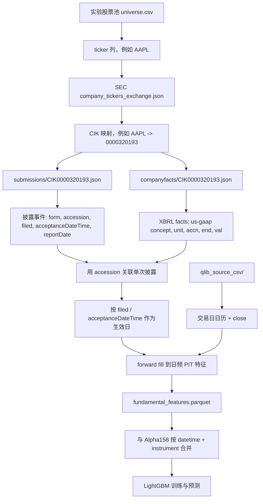
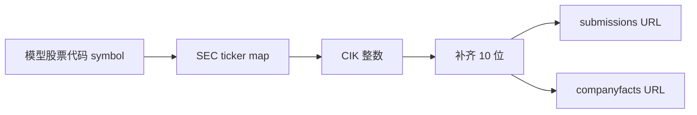
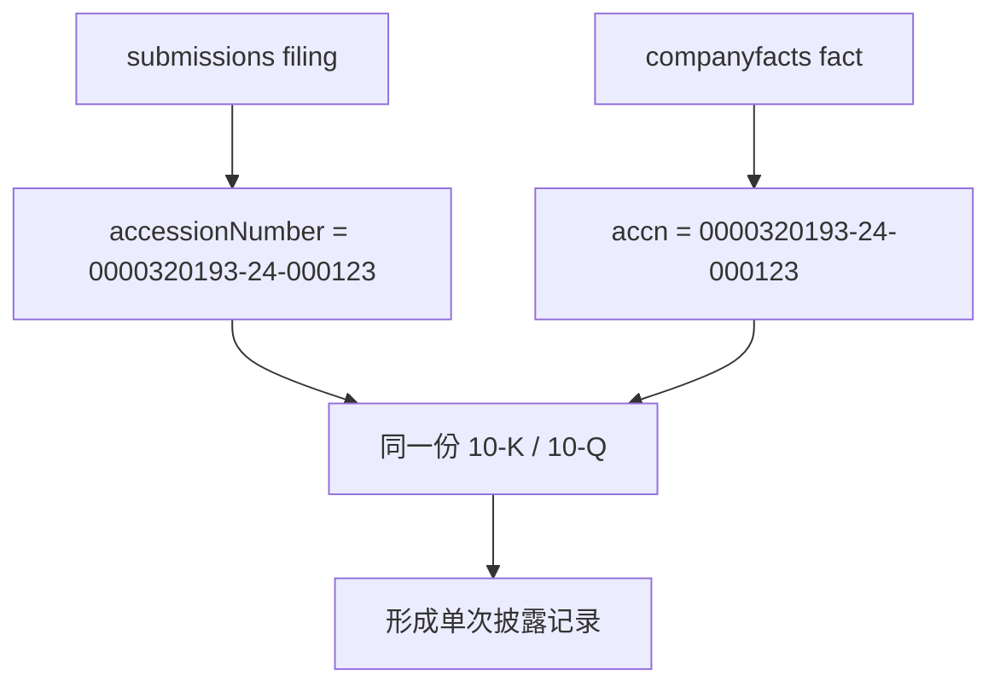
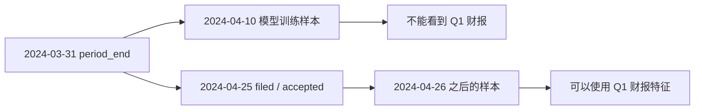
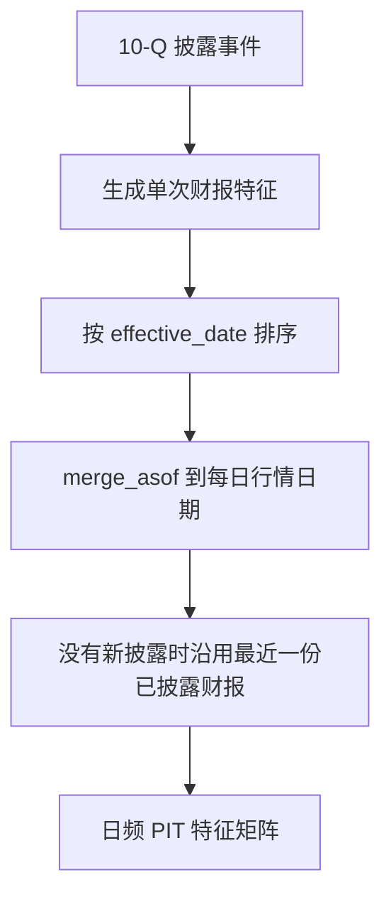
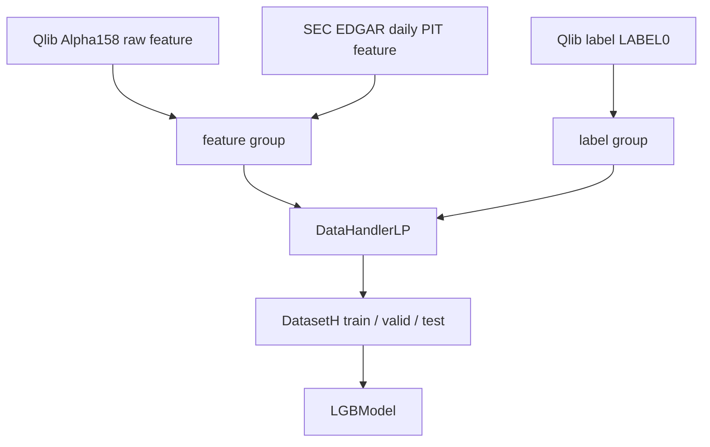

# SEC EDGAR Technical Data Flow

## 这篇解决什么问题

这篇只解释技术链路：

```text
我们到底从 SEC 拿了什么源数据？
为什么要做 CIK 映射？
PIT 到底是什么意思？
这些数据怎么变成 Qlib / LightGBM 可以训练的特征？
```

投资含义和特征解释看 [[SEC EDGAR Fundamentals Integration]]。

## 获取的源数据是什么

当前项目使用 3 类 SEC 官方 JSON 数据，加上本项目已有的日线行情。

| 数据 | URL 模板 | 用途 | 当前输出 |
|---|---|---|---|
| ticker / CIK / exchange 映射 | `https://www.sec.gov/files/company_tickers_exchange.json` | 把股票代码映射到 SEC 公司编号 | `edgar_cik_map.csv` |
| submissions | `https://data.sec.gov/submissions/CIK##########.json` | 获取公司提交历史、表格类型、披露日期、accession | 中间事件表 |
| companyfacts | `https://data.sec.gov/api/xbrl/companyfacts/CIK##########.json` | 获取 XBRL 结构化财务字段 | `fundamental_features.parquet` |
| 本项目行情 CSV | `qlib_source_csv/<symbol>.csv` | 提供交易日和 close，用于日频对齐与估值 | 估值特征 |

这些原始 SEC JSON 会缓存在：

```text
analysis/nasdaq_top500_score/runs/<experiment.name>/edgar_cache/
```

缓存不进入 Git。

## 总体数据流



## CIK 映射是什么

CIK 是 SEC 给每个申报主体分配的唯一编号，全称是 Central Index Key。

股票代码不是一个稳定的数据库主键，原因包括：

```text
公司可能改 ticker
同一公司可能有多类股票
不同交易所或历史时期可能出现代码变化
SEC API 的 submissions / companyfacts 入口使用 CIK，不使用 ticker
```

所以模型里看到的股票代码需要先经过一层映射：

```text
symbol -> CIK -> SEC filing / facts
```

例子：

```text
AAPL -> 320193 -> CIK0000320193
```

技术上，SEC endpoint 要求 CIK 补齐为 10 位：

```text
320193
-> 0000320193
-> CIK0000320193.json
```



当前输出的 `edgar_cik_map.csv` 用于复盘：

```text
symbol
cik
title
exchange
source
```

如果某只股票找不到 CIK，会进入：

```text
fundamental_failures.csv
error = missing_cik
```

## submissions 数据是什么

`submissions` 是公司提交历史。它告诉我们：

```text
这家公司提交过哪些文件
每份文件是什么表格类型
什么时候提交
SEC 什么时候接收
对应 accession number 是什么
财报覆盖哪个 period
```

当前项目重点读取这些字段：

```text
accessionNumber
form
filingDate
acceptanceDateTime
reportDate
```

其中：

```text
form：10-K、10-Q、10-K/A、10-Q/A
accessionNumber：一份 SEC filing 的唯一提交编号
filingDate：披露日期
acceptanceDateTime：SEC 接收时间
reportDate：财报覆盖期末
```

`submissions` 解决的是“什么时候市场能看到这份财报”。

## companyfacts 数据是什么

`companyfacts` 是从 XBRL 中抽出来的结构化财务事实。

它的大致层级是：

```text
facts
  us-gaap
    Revenues
      units
        USD
          - accn
          - form
          - filed
          - end
          - val
```

当前项目用 `us-gaap` concepts 抽取这些字段：

```text
revenue
gross_profit
operating_income
net_income
eps_diluted
assets
liabilities
equity
cash
operating_cash_flow
capex
shares_diluted
```

`companyfacts` 解决的是“财报里披露了什么数字”。

## accession 如何连接两类数据

`submissions` 有 accession number。

`companyfacts` 每条 fact 里也有 `accn`。

它们是连接一份 filing 和一组财务字段的关键。



没有 accession 这层连接，就容易把不同季度、不同表格、不同修订版本的财务数字混在一起。

## PIT 是什么

PIT 是 point in time，意思是“站在历史某一天，当时能看到什么”。

量化回测最怕未来函数。财报尤其容易产生未来函数，因为它有两个不同日期：

```text
period_end：财报覆盖的会计期末
filed / acceptanceDateTime：财报真正披露、市场能看到的时间
```

错误做法：

```text
财报期末是 2024-03-31
模型从 2024-03-31 开始使用这份财报
```

正确做法：

```text
财报在 2024-04-25 披露
模型从 2024-04-25 或之后的交易日才能使用
```



当前项目技术规则：

```text
effective_date = acceptanceDateTime，如果没有则用 filingDate
只在 effective_date 之后 forward fill
不按 reportDate / period_end 生效
```

## 日频 forward fill 是什么

财报是低频数据，股票模型是日频样本。

所以需要把一次披露扩展到后续交易日：

```text
2024-04-25 披露 Q1
2024-04-26 使用 Q1
2024-04-29 使用 Q1
2024-04-30 使用 Q1
直到下一份 10-Q / 10-K 披露
```



这就是 `fundamental_features.parquet`。

索引结构是：

```text
datetime
instrument
```

列名以 `edgar_` 开头，例如：

```text
edgar_revenue_ttm
edgar_gross_margin
edgar_roe
edgar_price_to_sales
edgar_days_since_last_10q
```

## 估值为什么需要行情

财报本身只能给出收入、利润、资产、现金流。

估值需要市场价格参与：

```text
market_cap = close * shares_diluted
price_to_sales = market_cap / revenue_ttm
price_to_book = market_cap / equity
price_to_earnings = market_cap / net_income_ttm
market_cap_to_fcf = market_cap / free_cash_flow_ttm
```

所以 EDGAR 适配器还会读取当前实验已经生成的：

```text
qlib_source_csv/<symbol>.csv
```

如果有 SEC 财报但没有对应行情，会写入：

```text
fundamental_failures.csv
error = missing_price
```

## 与 Alpha158 如何合并

Alpha158 和 EDGAR 特征的合并键是：

```text
datetime
instrument
```

合并前：

```text
Alpha158 feature columns:
KMID
KLEN
OPEN0
MA5
STD20
...
```

EDGAR feature columns:

```text
edgar_revenue_ttm
edgar_net_margin
edgar_liabilities_to_assets
edgar_price_to_book
...
```

合并后：

```text
feature:
  Alpha158 columns
  edgar_ columns

label:
  LABEL0
```



## 失败文件怎么理解

`fundamental_failures.csv` 不是报错日志，而是数据验收表。

常见原因：

| error | 含义 |
|---|---|
| `missing_cik` | 当前 ticker 在 SEC 映射表里找不到 |
| `insufficient_filings` | 10-K / 10-Q 数量不足 |
| `missing_fields` | 某些 us-gaap 字段缺失 |
| `missing_price` | 有财报但没有本项目日线价格 |
| `api_or_parse_error` | SEC 请求或解析失败 |

这些失败不能简单忽略。后续复盘要看：

```text
失败是否集中在 ADR、金融股、特殊股份类别或新上市公司？
缺失字段是否来自公司自定义 XBRL tag？
是否需要行业分组后采用不同字段口径？
```

## 当前实现文件

核心代码：

```text
analysis/nasdaq_top500_score/fundamentals/sec_edgar.py
analysis/nasdaq_top500_score/run_qlib_alpha158_lightgbm.py
```

配置：

```text
analysis/nasdaq_top500_score/configs/nasdaq_alpha158_edgar_lgbm_1d.yaml
```

测试：

```text
tests/analysis/test_sec_edgar_fundamentals.py
```

## 官方资料

- [SEC EDGAR APIs](https://www.sec.gov/search-filings/edgar-application-programming-interfaces)
- [Accessing EDGAR Data](https://www.sec.gov/search-filings/edgar-search-assistance/accessing-edgar-data)

## 相关笔记

[[SEC EDGAR Fundamentals Integration]]
[[Alpha158 And Features]]
[[Data Source Upgrade Plan]]
