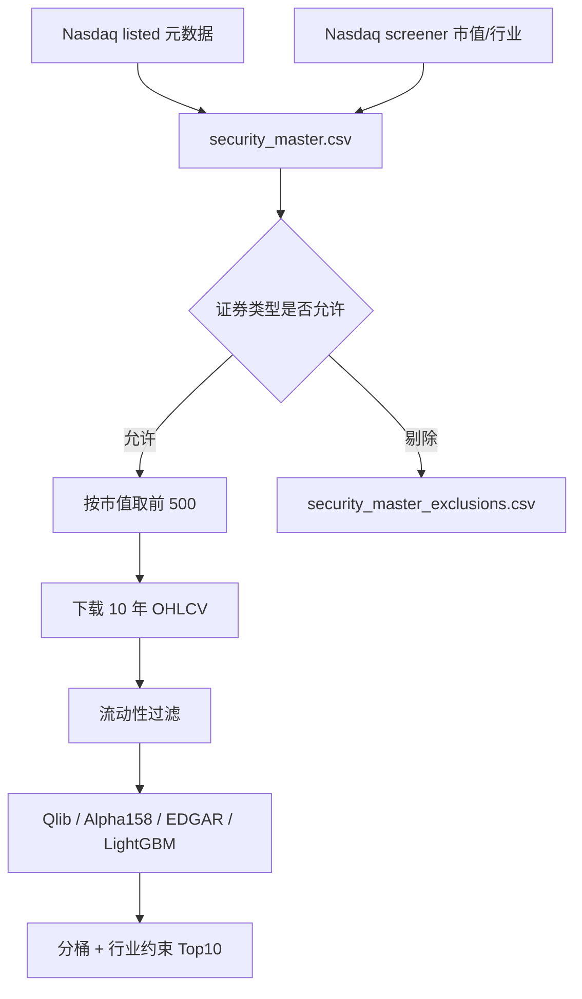

# Security Master Data

## 学习目标

理解为什么量化研究不能只看一个股票代码和公司名称。

证券主数据回答的是：

```text
这个 symbol 到底代表什么证券？
它是普通股、ADR、优先股、权证、债券、unit，还是其他东西？
它是否是测试证券、ETF 或特殊上市证券？
它属于哪个 share class？
```

## 为什么要做

模型只会处理输入数据，不会天然知道证券类型。

如果股票池里混入 warrant、preferred、unit、right、notes、bond，模型仍然会给它们打分，但这些证券的收益结构、流动性、风险和财报口径都和普通股不同。

证券主数据的作用是先定义“哪些证券允许进入研究股票池”。

## 本次主数据来源

第一版仍使用免费公开数据，不接商业证券主数据。

来源包括：

```text
Nasdaq listed 文件：symbol、security_name、market_category、test_issue、financial_status、round_lot_size、ETF
Nasdaq screener：name、market_cap、last_sale、sector、industry
```

它们合并后生成：

```text
security_master.csv
security_master_exclusions.csv
```

## 本次分类口径

当前分类结果包括：

```text
common_stock
ordinary_share
adr_ads
unknown_equity_like
warrant
preferred
debt
unit
right
depositary_share
```

允许进入股票池：

```text
common_stock
ordinary_share
adr_ads
unknown_equity_like
```

剔除：

```text
warrant
preferred
debt
unit
right
depositary_share
ETF
test issue
```

`unknown_equity_like` 暂时保留。原因是免费公开数据的证券名称不一定完整，如果没有明显特殊证券标记，第一版不强行剔除，避免误杀普通权益证券。

## 在流水线中的位置

证券主数据过滤发生在下载日线之前。



所以它影响的是“哪些证券进入股票池”，不是直接改变模型特征或标签。

## 如何影响模型

证券主数据的影响路径是：

```text
主数据过滤 -> 股票池变化 -> 可下载日线变化 -> Qlib 训练样本变化 -> 横截面预测和 Top10 变化
```

它不生成新的 Alpha158 特征，也不改变未来收益标签。

它主要降低两类风险：

```text
把非普通股证券误当普通股训练
把特殊证券放进最终候选组合
```

## 本次实验结果

运行配置：

```text
analysis/nasdaq_top500_score/configs/nasdaq_alpha158_edgar_lgbm_10y_clean_bucket_top10.yaml
```

证券主数据结果：

```text
主数据记录数：3533
主数据剔除数：443
ADR/ADS 数量：162
Share class 数量：571
```

资产类型分布：

```text
common_stock：2332
ordinary_share：456
warrant：279
adr_ads：162
unknown_equity_like：140
preferred：104
debt：36
unit：15
right：5
depositary_share：4
```

剔除原因：

```text
warrant：279
preferred：104
debt：36
unit：15
right：5
depositary_share：4
```

证券主数据、流动性过滤、分桶和行业约束之后，最终 Top10：

```text
AAOI
IBRX
LUNR
AXTI
FLEX
SNDK
CELC
QS
CORZ
LQDA
```

## 当前限制

第一版仍然不是专业级证券主数据。

限制包括：

```text
不是历史 PIT 证券主数据
不能处理所有公司行为和 ticker 变更
ADR/ADS 只是标记，未单独建模国家和汇率风险
unknown_equity_like 仍需要后续人工或更强数据源复核
没有 primary listing / secondary listing 的完整口径
```

更严谨的研究应使用 Norgate、CRSP、Refinitiv、FactSet、Polygon、NASDAQ Data Link 等更完整的证券主数据或自建主数据表。

## 下一步

进入第 4 条：未来 5 日收益标签。

目标是把当前 1 日收益标签改成更平滑的 5 日收益标签，并对比 IC、Rank IC、Top10 稳定性。

相关笔记：

[[Stock Pool Cleaning And History Buckets]]
[[Liquidity Filtering]]
[[Data Scope And Sources]]
[[Labels And Future Returns]]
[[Stage Completion Records]]
