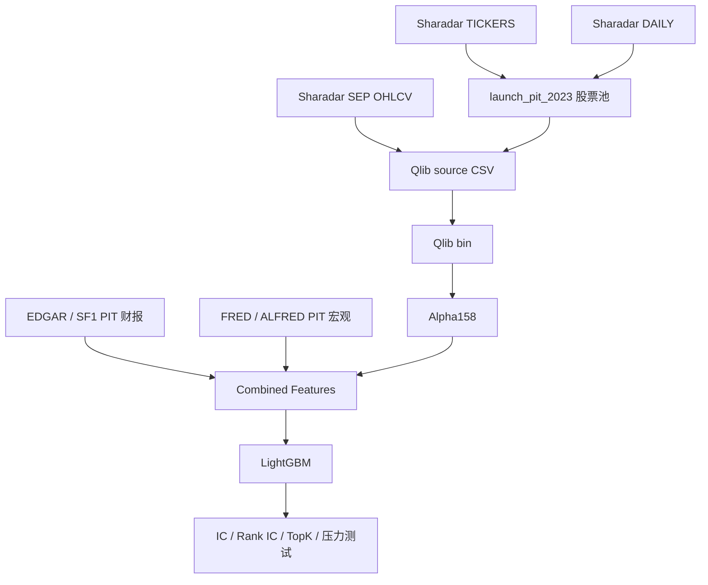

# Sharadar Strict Launch PIT Integration

## 目标

这一步把严格回测的数据源从 `nasdaq_public` / Norgate 方案，扩展到 **Sharadar / Nasdaq Data Link**。

核心目标不是提高收益，而是解决当前高收益里最危险的两个问题：

- 股票池不能再用当前 Nasdaq 市值快照。
- `launch_pit_2023` 不能再用 `current_market_cap * asof_close / latest_close` 反推历史市值。

严格口径要求：如果字段、订阅或 API key 不满足要求，实验必须停在 capability probe，不允许自动退回 `nasdaq_public`。

## Sharadar 能解决什么

Sharadar 适合作为个人可落地的严格研究数据源，原因是它同时覆盖：

- active tickers：当前仍上市的股票。
- delisted tickers：后来退市、并购、破产或停止交易的股票。
- EOD prices：日频 OHLCV，适合生成 Alpha158。
- fundamentals：结构化基本面字段，可与 EDGAR 或 SF1 对照。
- metadata：ticker、exchange、security type、first/last price date 等证券主数据。

它不等于 CRSP / Compustat 学术金标准。这里的定位是：比当前公开 Nasdaq snapshot 严格得多，适合个人研究和 Qlib 学习，但仍需要字段验收和口径标注。

## launch_pit_2023 是什么

`launch_pit_2023` 的含义是：站在 2023-12-31 这个时间点，构建当时可见的股票池，然后只用这批股票做 2024-2026 的测试。

实际交易日使用：

```text
as_of_date = 2023-12-31
as_of_trade_date = 2023-12-29
```

为什么要分两个日期：

- 2023-12-31 是自然日，但不是交易日。
- 2023-12-29 是 2023 年最后一个美股交易日。
- 市值、价格、是否可交易，都应该落到真实交易日。

严格选择规则：

```text
候选池 = 2023-12-29 当天仍有价格记录的美国普通权益证券
市值 = 2023-12-29 当时可见的 marketcap 或 shares outstanding × 当日价格
排名 = 按 as-of 市值排序
股票池 = Nasdaq 前 500
```

如果历史 Nasdaq exchange 口径无法被证明是 PIT，报告必须标记风险。必要时先降级为 `US equities top500 strict`，不要硬说是严格 Nasdaq Top500。

## capability probe

新增的 capability probe 会先检查当前 API key 和订阅能不能访问这些表：

```text
SHARADAR/TICKERS
SHARADAR/SEP
SHARADAR/SF1
SHARADAR/DAILY
SHARADAR/INDICATORS
```

它不会直接训练模型，而是输出：

```text
provider_capability_summary.yaml
provider_table_columns.csv
provider_capability_report.md
```

必须通过的字段能力：

```text
TICKERS: active/delisted 状态
TICKERS: security type / category
TICKERS: exchange
TICKERS: first/last priced date 或 listing/delisting date
SEP: ticker/date/open/high/low/close/volume
DAILY 或 SF1: PIT market cap 或 shares outstanding
SF1: datekey / filing date / report period
```

如果这些字段缺失，或者 API key 没有订阅权限，程序会写出 probe 报告，然后停止，不进入 Qlib 训练。

## 数据如何进入模型

Sharadar 不替代 Alpha158。它替代的是 Alpha158 的底层输入。



模型输入仍然是：

```text
Alpha158
EDGAR / fundamental features
market derived features
macro features 或 macro interactions
```

区别在于：

- 股票池不再来自今天的 Nasdaq snapshot。
- 市值不再由当前市值反推。
- 退市股票不会天然消失。
- 每只股票的可交易历史可以被追溯。

## 当前实现状态

已新增：

```text
data.source = sharadar
SharadarDataSource
SharadarClient
capability probe
strict_sharadar_* 配置
provider capability 输出
```

新增 strict 配置：

```text
strict_base_sharadar_launch_pit_2023_5d.yaml
strict_sharadar_baseline_alpha158_edgar_5d.yaml
strict_sharadar_macro_direct_5d.yaml
strict_sharadar_macro_interactions_no_credit_5d.yaml
```

当前没有把 API key 写进仓库。需要在 ignored `.env` 写：

```bash
NASDAQ_DATA_LINK_API_KEY=你的_key
```

也支持：

```bash
SHARADAR_API_KEY=你的_key
```

## 验收标准

实验只有在以下条件都满足时，才允许成为 strict headline：

- `provider_capability_summary.yaml` 中 `strict_capability_pass: true`
- `pit_universe_validation.csv` 不存在 strict blocking failure
- `market_cap_validation.csv` 没有当前市值反推风险
- `security_master_validation.csv` 有 first/last quoted date
- `data_quality_summary.yaml` 中 `strict_headline_allowed: true`

否则结果只能作为学习观察。

## 下一步

下一步需要真实 `NASDAQ_DATA_LINK_API_KEY` 和 Sharadar 订阅。

拿到后先运行 Sharadar strict baseline 配置，看 capability probe 是否通过；通过后再跑完整 Qlib 训练。若 probe 不通过，优先根据失败字段决定是补订阅、改字段映射，还是换 CRSP / QuantRocket / EDI 路线。

学习研究，不是投资建议。
