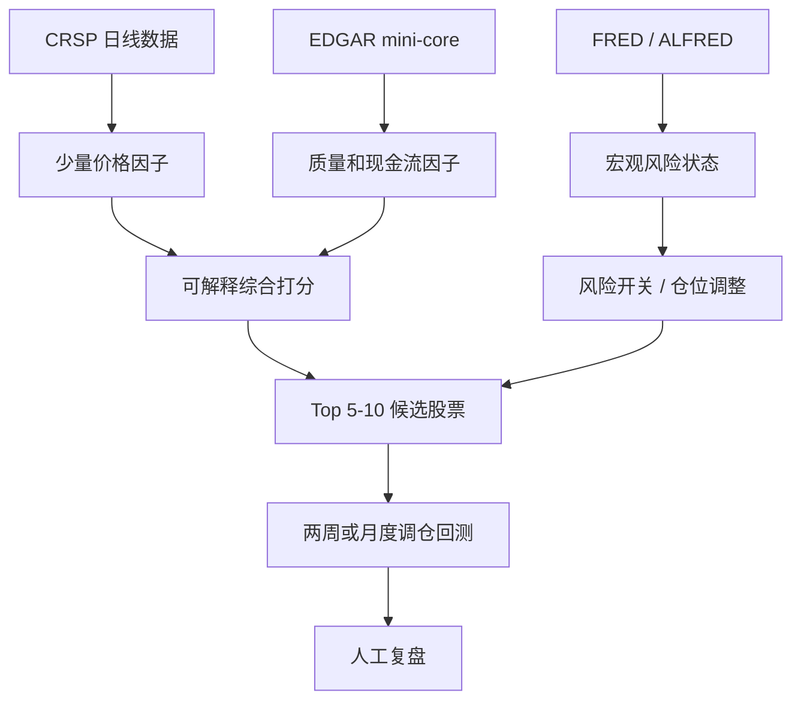

# Personal Quant V1 Direction

## 新阶段目标

新阶段不再追求构建大型机器学习研究平台，而是构建一个个人研究者可以理解、维护和执行的小型选股系统。

阶段名称：

```text
Personal Quant v1：小资金可解释选股系统
```

目标不是最高收益，而是：

```text
用少量可靠变量，筛出 5-10 只可以解释、可以复盘、可以实际持有的股票。
```

## 为什么要换架构

上一阶段已经证明：

- Alpha158 + EDGAR + macro + interaction 的路线太重。
- 训练慢，变量多，解释难。
- rolling window 不稳定，不能把 2024-2025 单窗口好结果当作结论。
- Top30 / Top50 虽能分散风险，但不适合小资金实盘。
- 小资金更需要清晰的买入理由，而不是高维模型黑箱。

因此新阶段要先定义能力边界。

## 能力边界

| 维度 | Personal Quant v1 边界 |
|---|---|
| 股票池 | CRSP US Common Equity 动态大市值股票池 |
| 持仓数量 | 5-10 只 |
| 调仓频率 | 每 10 个交易日或每月 |
| 数据类型 | 价格成交量 + 少量财报 + 少量宏观状态 |
| 特征数量 | 10-30 个以内 |
| 默认模型 | 可解释打分优先，简单模型其次 |
| 宏观数据 | 先做风险开关，不直接堆进选股模型 |
| 财报数据 | 只保留 mini-core 盈利质量和现金流字段 |
| 风控 | 单票上限、beta 限制、波动过滤、行业暴露复盘 |
| 目标 | 稳定、可解释、可复盘、可手工执行 |

## 暂时不做

新阶段先明确不做这些事：

- 不默认使用 Alpha158。
- 不使用 100+ 个特征训练黑箱模型。
- 不继续扩展宏观交互特征。
- 不继续大规模 EDGAR 字段 ablation。
- 不把 Top30 / Top50 当作实盘组合。
- 不追求单窗口最高收益。
- 不在没有解释的情况下让模型自动买入。

## 新架构



## 默认因子设计

第一版只保留少数经济含义清楚的因子。

### 价格动量

| 因子 | 含义 |
|---|---|
| 3个月收益 | 中短期趋势 |
| 6个月收益 | 中期趋势 |
| 12个月收益 | 长期趋势 |
| 近10日收益 | 短期过热或反转风险 |

### 风险和稳定性

| 因子 | 含义 |
|---|---|
| 60日波动率 | 股价波动风险 |
| 120日 beta | 市场敏感度 |
| 60日最大回撤 | 近期下跌风险 |
| 成交额 | 可交易性 |

### 财报质量

第一版只用 EDGAR mini-core：

| 因子 | 含义 |
|---|---|
| operating_margin | 经营盈利能力 |
| net_margin | 净利润率 |
| free_cash_flow_ttm | 自由现金流 |
| fcf_margin | 自由现金流率 |
| operating_cash_flow_ttm | 经营现金流 |

### 估值

估值第一版要谨慎使用，只作为过滤或轻权重打分：

| 因子 | 含义 |
|---|---|
| price_to_sales | 销售额估值 |
| price_to_book | 净资产估值 |

如果估值字段覆盖不稳定或极端值太多，先不进入主分数。

### 宏观状态

宏观不直接作为股票打分主变量，先作为风险开关：

| 状态 | 用途 |
|---|---|
| VIX 高位 | 降仓或减少高 beta 股票 |
| 10Y 利率上行 | 降低高估值成长股暴露 |
| 信用利差扩大 | 降低高负债股票暴露 |
| 收益率曲线倒挂 | 标记宏观压力期 |

## 第一版打分方式

优先使用可解释打分，而不是直接训练 LightGBM。

示例：

```text
score =
  30% momentum_score
  25% quality_score
  20% low_risk_score
  15% liquidity_score
  10% valuation_score
```

每个子分数都用分位数或 z-score，确保可以解释。

每只入选股票都要生成解释：

```text
入选原因：6个月动量强、经营利润率高、现金流好、波动低。
主要风险：beta 偏高、近期 VIX 高位。
```

## 组合规则

默认组合规则：

| 参数 | 默认值 |
|---|---|
| 持仓数量 | 5-10 只 |
| 单票上限 | 15%-20% |
| 调仓周期 | 10 个交易日或每月 |
| 入场价格 | 次日 open |
| 行业限制 | 单 SIC2 sector 最多 2-3 只 |
| 高 beta 限制 | beta > 1.5 降权或剔除 |
| 高波动限制 | 60日波动率过高降权或剔除 |

## 第一阶段实验

### Step 1：建立干净目录

建议新代码目录：

```text
analysis/personal_quant_v1/
```

目录职责：

```text
data/          数据读取和缓存接口
features/      少量可解释因子
scoring/       因子打分和权重
portfolio/     Top5-10 组合构建
reports/       每期持仓解释和复盘
configs/       小型策略配置
```

这个目录不复用旧的高维实验脚本，只复用成熟的数据产物和经验。

### Step 2：先做 Alpha158-free baseline

输入：

```text
CRSP 动态大市值股票池
少量价格因子
少量风险因子
EDGAR mini-core 可选
```

输出：

```text
Top5 / Top10 可解释持仓
每只股票的入选理由
组合回测
失败样本复盘
```

### Step 3：滚动窗口验证

至少验证：

```text
2018-2019
2020-2021
2022-2023
2024-2025
```

只有跨窗口稳定，才进入下一步。

### Step 4：人工复盘

每个窗口输出：

```text
买了哪些股票
为什么买
亏损来自哪里
是否符合原始假设
是否可以手工接受
```

## 判断标准

新阶段策略必须满足：

```text
可以解释每只持仓。
持仓数量适合小资金。
不依赖 Top30 / Top50 分散。
跨多个窗口不明显失效。
高波动和高 beta 环境有明确风控。
变量数量少到可以人工复盘。
```

如果收益一般但逻辑清楚，可以继续优化。

如果收益高但解释不清，不进入实盘候选。

## 与旧阶段的关系

旧阶段不是废弃，而是降级为研究资料库：

| 旧阶段能力 | 新阶段如何使用 |
|---|---|
| CRSP 数据仓 | 继续作为数据底座 |
| 动态 Top500 | 简化后继续使用 |
| EDGAR mini-core | 只保留少数字段 |
| FRED / ALFRED | 做风险状态，不做高维输入 |
| rolling window | 继续作为稳定性验证 |
| 失败复盘 | 继续作为每阶段必做动作 |
| Alpha158 | 不做默认主线，只做参考 |

## 下一步

下一步先建立干净代码目录：

```text
analysis/personal_quant_v1/
```

然后实现第一条最小可行链路：

```text
CRSP 数据读取 -> 10-15 个可解释因子 -> 因子打分 -> Top5/Top10 -> 两周回测 -> 持仓解释报告
```

第一版不追求复杂模型，只追求：

```text
清楚、稳定、可解释、能复盘。
```

## 相关笔记

[[CRSP Large Research Stage Summary]]
[[CRSP Portfolio Construction And Risk Filter Repair]]
[[CRSP Rolling Window Validation]]
[[CRSP EDGAR Coverage Cleaning And Ablation]]
